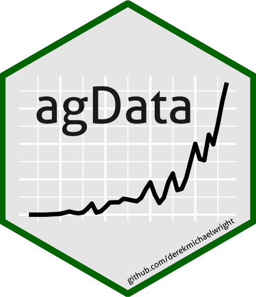

```{r setup, include = FALSE}
knitr::opts_chunk$set(echo = T, fig.width = 10, fig.height = 4)
```



`agData`: an `R` package containing various agricultural data sets

# Installation

```{r eval = F}
devtools::install_github("derekmichaelwright/agData")
```

# Introduction

[Click Here for an Introduction to `agData`](https://derekmichaelwright.github.io/htmls/agdata/introduction_to_agdata.htm
# Vignettes

[Click here for `agData` vignettes](https://dblogr.com/#posts_agdata)

# Data Sources

- `FAO` Food and Agriculture Organization of the United Nations [fao.org/faostat/](fao.org/faostat/)
- `STATCAN` Statistics Canada [statcan.gc.ca/](statcan.gc.ca/)
- `USDA` United States Department of Agriculture [usda.gov/](usda.gov/)
- `ISAAA` International Service for the Acquisition of Agri-biotech Applications [isaaa.org/](isaaa.org/)
