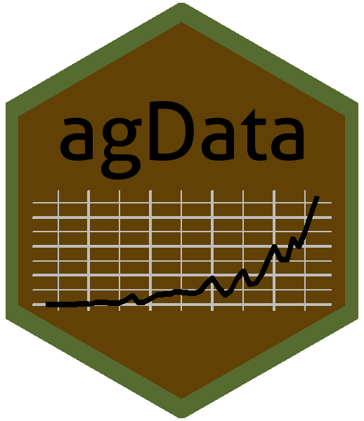

```{r setup, include = FALSE}
knitr::opts_chunk$set(echo = T, fig.width = 10, fig.height = 4)
```

# agData 

`agData` contains various agricultural data sets for quick use in `R`:

- [`agData_FAO_Crops`](#agdata_fao_crops)
- [`agData_FAO_LandUse`](#agdata_fao_landuse)
- [`agData_FAO_Livestock`](#agdata_fao_livestock)
- [`agData_FAO_Trade`](#agdata_fao_trade)
- [`agData_STATCAN_Beehives`](#agdata_statcan_beehives)
- [`agData_STATCAN_Crops`](#agdata_statcan_crops)
- [`agData_STATCAN_Livestock`](#agdata_statcan_livestock)
- [`agData_USDA_Crops`](#agdata_usda_crops)

#### Data Sources

- `STATCAN` Statistics Canada [statcan.gc.ca/](statcan.gc.ca/)  
- `USDA` United States Department of Agriculture [usda.gov/](usda.gov/)
- `FAO` Food and Agriculture Organization of the United Nations [fao.org/faostat/](fao.org/faostat/)

## Instalation

Use the following code to install the `agdata` package in R

```{r eval = F}
devtools::install_github("derekmichaelwright/agData")
```

```{r warning = F, message = F}
library(agData)
```

---

<em>\newpage</em>

# agData_FAO_Crops

```{r}
# Get Data
xx <- agData_FAO_Crops %>% as.tibble()
xx
# List Measurements
xx %>% distinct(Measurement, Unit)
# List Crops
xx %>% distinct(Crop)
# Spread data to wide format
xx %>% select(-Unit) %>% spread(Measurement, Value) %>% arrange(Year)
```

```{r}
# Prep data for an example plot
xx <- xx %>% filter(Area == "Canada", Crop == "Lentils", Measurement == "Production")
# Plot
ggplot(xx, aes(x = Year, y = Value/1000000, group = Area)) + geom_line() +
  labs(title = "Lentil Production in Canada", 
       y = "million tonnes", x = NULL)
```

---

<em>\newpage</em>

# agData_FAO_LandUse

```{r}
# Get Data
xx <- agData_FAO_LandUse %>% as.tibble()
xx
# List Measurements
xx %>% distinct(Measurement, Unit)
# List Crops
xx %>% distinct(Type)
```

<em>\newpage</em>

```{r}
# Prep data for an example plot
xx <- xx %>% filter(Area == "World", Type == "Agricultural area")
# Plot
ggplot(xx, aes(x = Year, y = Value/1000000, group = Area)) + geom_line() +
  labs(title = "Global Agricultural Area", 
       y = "billion hectares", x = NULL)
```

---

<em>\newpage</em>

# agData_FAO_Livestock
  
```{r}
# Get Data
xx <- agData_FAO_Livestock %>% as.tibble()
xx
# List Measurements
xx %>% distinct(Measurement, Unit)
# List Crops
xx %>% distinct(Animal)
```

<em>\newpage</em>

```{r}
# Prep data for an example plot
xx <- xx %>% filter(Area == "Canada", Animal == "Chickens")
# Plot
ggplot(xx, aes(x = Year, y = Value/1000000, group = Area)) + geom_line() +
  labs(title = "Chicken Production in Canada", 
       y = "Million Animals", x = NULL)
```

---

<em>\newpage</em>

# agData_FAO_Trade
  
```{r}
# Get Data
xx <- agData_FAO_Trade %>% as.tibble()
xx
# List Measurements
xx %>% distinct(Measurement, Unit)
# List Crops
xx %>% distinct(Item)
```

```{r}
# Prep data for an example plot
xx <- xx %>% filter(Area == "India", Item == "Lentils", Measurement == "Import Quantity")
# Plot
ggplot(xx, aes(x = Year, y = Value/1000000, group = Measurement)) + geom_line() +
  labs(title = "Lentil Imports in India", 
       y = "million tonnes", x = NULL)
```

---

<em>\newpage</em>

# agData_STATCAN_Beehives
  
```{r}
# Get Data
xx <- agData_STATCAN_Beehives %>% as.tibble()
xx
# List Measurements
xx %>% distinct(Measurement, Unit)
# Spread data to wide format
xx %>% select(-Unit) %>% spread(Measurement, Value) %>% arrange(Year)
```

```{r}
# Prep data for an example plot
xx <- xx %>% filter(Area == "Saskatchewan", Measurement == "Colonies")
# Plot
ggplot(xx, aes(x = Year, y = Value/1000, group = Area)) + geom_line() +
  labs(title = "Honeybee Colonies in Saskatchewan, Canada", 
       y = "Thousand Colonies", x = NULL)
```

---

<em>\newpage</em>

# agData_STATCAN_Crops
  
```{r}
# Get Data
xx <- agData_STATCAN_Crops %>% as.tibble()
xx
# List Measurements
xx %>% distinct(Measurement, Unit)
# List Crops
xx %>% distinct(Crop)
```

```{r}
# Prep data for an example plot
xx <- xx %>% filter(Area == "Saskatchewan", Crop == "Canola", Measurement == "Production")
# Plot
ggplot(xx, aes(x = Year, y = Value/1000000, group = Area)) + geom_line() +
  labs(title = "Canola Production in Saskatchewan, Canada", 
       y = "million tonnes", x = NULL)
```

---

<em>\newpage</em>

# agData_STATCAN_Livestock
  
```{r}
# Get Data
xx <- agData_STATCAN_Livestock %>% as.tibble()
xx
# List Measurements
xx %>% distinct(Measurement, Unit)
# List Crops
xx %>% distinct(Animal)
# Spread data to wide format
xx %>% select(-Unit) %>% spread(Measurement, Value) %>% arrange(Year)
```

```{r}
# Prep data for an example plot
xx <- xx %>% filter(Area == "Saskatchewan", Measurement == "Number of animals",
                    Animal == "Total hens and chickens (birds)")
# Plot
ggplot(xx, aes(x = Year, y = Value/1000000)) + geom_line() +
  labs(title = "Chicken Production in Saskatchewan", 
       y = "Million Animals", x = NULL)
```

---

<em>\newpage</em>

# agData_USDA_Crops
  
```{r}
# Get Data
xx<- agData_USDA_Crops %>% as.tibble()
xx
# List Measurements
xx %>% distinct(Measurement, Unit)
# List Area
xx %>% distinct(Area)
# List Crops
xx %>% distinct(Crop)
# Spread data to wide format
xx %>% select(-Unit) %>% spread(Measurement, Value) %>% arrange(Year)
```

```{r}
# Prep data for an example plot
xx <- xx %>% filter(Crop == "Wheat", Measurement == "Production")
# Plot
ggplot(xx, aes(x = Year, y = Value/1000000, group = Area)) + geom_line() +
  labs(title = "Wheat Production in the United States of America", 
       y = "million tonnes", x = NULL)
```

---
