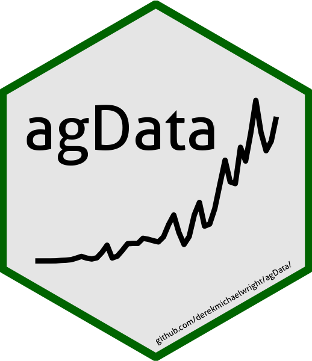

```{r setup, include = FALSE}
knitr::opts_chunk$set(echo = T, message = F, warning = F)
```

`agData`: an `R` package containing various agricultural data sets



---

# Installation

```{r eval = F}
devtools::install_github("derekmichaelwright/agData")
```

```{r}
library(agData)
```

---

# Vignettes

[agData Vignettes](https://derekmichaelwright.github.io/dblogr/#agdata)

---

# Data Sources

- `FAO` Food and Agriculture Organization of the United Nations [www.fao.org/faostat/](https://www.fao.org/faostat/)
- `STATCAN` Statistics Canada [www.statcan.gc.ca/](https://www.statcan.gc.ca/)
- `USDA` United States Department of Agriculture [www.nass.usda.gov/](https://www.nass.usda.gov/)
- `ISAAA` International Service for the Acquisition of Agri-biotech Applications [www.isaaa.org/](https://www.isaaa.org/)

---

# Data sets

## STATCAN

- [agData_STATCAN_Crops.csv.gz](https://raw.githubusercontent.com/derekmichaelwright/agData/master/Data/agData_STATCAN_Crops.csv.gz)
- [agData_STATCAN_Crops2.csv.gz](https://raw.githubusercontent.com/derekmichaelwright/agData/master/Data/agData_STATCAN_Crops2.csv.gz)
- [agData_STATCAN_Livestock.csv.gz](https://raw.githubusercontent.com/derekmichaelwright/agData/master/Data/agData_STATCAN_Livestock.csv.gz)
- [agData_STATCAN_Beehives.csv.gz](https://raw.githubusercontent.com/derekmichaelwright/agData/master/Data/agData_STATCAN_Beehives.csv.gz)
- [agData_STATCAN_FarmLand_Crops.csv.gz](https://raw.githubusercontent.com/derekmichaelwright/agData/master/Data/agData_STATCAN_FarmLand_Crops.csv.gz)
- [agData_STATCAN_FarmLand_Farms.csv.gz](https://raw.githubusercontent.com/derekmichaelwright/agData/master/Data/agData_STATCAN_FarmLand_Farms.csv.gz)
- [agData_STATCAN_FarmLand_Inputs.csv.gz](https://raw.githubusercontent.com/derekmichaelwright/agData/master/Data/agData_STATCAN_FarmLand_Inputs.csv.gz)
- [agData_STATCAN_FarmLand_Size.csv.gz](https://raw.githubusercontent.com/derekmichaelwright/agData/master/Data/agData_STATCAN_FarmLand_Size.csv.gz)
- [agData_STATCAN_FarmLand_Use.csv.gz](https://raw.githubusercontent.com/derekmichaelwright/agData/master/Data/agData_STATCAN_FarmLand_Use.csv.gz)
- [agData_STATCAN_FarmReceipts.csv.gz](https://raw.githubusercontent.com/derekmichaelwright/agData/master/Data/agData_STATCAN_FarmReceipts.csv.gz)
- [agData_STATCAN_Farmers.csv.gz](https://raw.githubusercontent.com/derekmichaelwright/agData/master/Data/agData_STATCAN_Farmers.csv.gz)
- [agData_STATCAN_Population.csv.gz](https://raw.githubusercontent.com/derekmichaelwright/agData/master/Data/agData_STATCAN_Population.csv.gz)
- [agData_STATCAN_Region_Table.csv.gz](https://raw.githubusercontent.com/derekmichaelwright/agData/master/Data/agData_STATCAN_Region_Table.csv.gz)

---

## FAO

- [agData_FAO_Crops.csv.gz](https://raw.githubusercontent.com/derekmichaelwright/agData/master/Data/agData_FAO_Crops.csv.gz)
- [agData_FAO_Crops2.csv.gz](https://raw.githubusercontent.com/derekmichaelwright/agData/master/Data/agData_FAO_Crops2.csv.gz)
- [agData_FAO_Livestock.csv.gz](https://raw.githubusercontent.com/derekmichaelwright/agData/master/Data/agData_FAO_Livestock.csv.gz)
- [agData_FAO_Trade_Quantity.csv.gz](https://raw.githubusercontent.com/derekmichaelwright/agData/master/Data/agData_FAO_Trade_Quantity.csv.gz)
- [agData_FAO_Trade_Value.csv.gz](https://raw.githubusercontent.com/derekmichaelwright/agData/master/Data/agData_FAO_Trade_Value.csv.gz)
- [agData_FAO_Fertilizers.csv.gz](https://raw.githubusercontent.com/derekmichaelwright/agData/master/Data/agData_FAO_Fertilizers.csv.gz)
- [agData_FAO_LandUse.csv.gz](https://raw.githubusercontent.com/derekmichaelwright/agData/master/Data/agData_FAO_LandUse.csv.gz)
- [agData_FAO_Population.csv.gz](https://raw.githubusercontent.com/derekmichaelwright/agData/master/Data/agData_FAO_Population.csv.gz)
- [agData_FAO_Producer_Prices.csv.gz](https://raw.githubusercontent.com/derekmichaelwright/agData/master/Data/agData_FAO_Producer_Prices.csv.gz)
- [agData_FAO_Consumer_Prices.csv.gz](https://raw.githubusercontent.com/derekmichaelwright/agData/master/Data/agData_FAO_Consumer_Prices.csv.gz)
- [agData_FAO_Region_Table.csv.gz](https://raw.githubusercontent.com/derekmichaelwright/agData/master/Data/agData_FAO_Region_Table.csv.gz)
- [agData_FAO_Country_Table.csv.gz](https://raw.githubusercontent.com/derekmichaelwright/agData/master/Data/agData_FAO_Country_Table.csv.gz)

---

## USDA

- [agData_USDA_Crops.csv.gz](https://raw.githubusercontent.com/derekmichaelwright/agData/master/Data/agData_USDA_Crops.csv.gz)
- [agData_USDA_GE_Crops.csv.gz](https://raw.githubusercontent.com/derekmichaelwright/agData/master/Data/agData_USDA_GE_Crops.csv.gz)
- [agData_USDA_TFP.csv.gz](https://raw.githubusercontent.com/derekmichaelwright/agData/master/Data/agData_USDA_TFP.csv.gz)

---

## ISAAA

- [agData_ISAAA_Crop.csv.gz](https://raw.githubusercontent.com/derekmichaelwright/agData/master/Data/agData_ISAAA_Crop.csv.gz)
- [agData_ISAAA_Area.csv.gz](https://raw.githubusercontent.com/derekmichaelwright/agData/master/Data/agData_ISAAA_Area.csv.gz)
- [agData_ISAAA_Coutnry.csv.gz](https://raw.githubusercontent.com/derekmichaelwright/agData/master/Data/agData_ISAAA_Coutnry.csv.gz)
- [agData_ISAAA_CropPercent.csv.gz](https://raw.githubusercontent.com/derekmichaelwright/agData/master/Data/agData_ISAAA_CropPercent.csv.gz)
- [agData_ISAAA_DVDDVG.csv.gz](https://raw.githubusercontent.com/derekmichaelwright/agData/master/Data/agData_ISAAA_DVDDVG.csv.gz)
- [agData_ISAAA_Value.csv.gz](https://raw.githubusercontent.com/derekmichaelwright/agData/master/Data/agData_ISAAA_Value.csv.gz)

---

## Other

- [agData_Barulina.csv.gz](https://raw.githubusercontent.com/derekmichaelwright/agData/master/Data/agData_Barulina.csv.gz)
- [agData_LongTermMaize.csv.gz](https://raw.githubusercontent.com/derekmichaelwright/agData/master/Data/agData_LongTermMaize.csv.gz)
- [agData_MazieContest.csv.gz](https://raw.githubusercontent.com/derekmichaelwright/agData/master/Data/agData_MazieContest.csv.gz)
- [agData_PeopleInAg.csv.gz](https://raw.githubusercontent.com/derekmichaelwright/agData/master/Data/agData_PeopleInAg.csv.gz)
- [agData_PopFert.csv.gz](https://raw.githubusercontent.com/derekmichaelwright/agData/master/Data/agData_PopFert.csv.gz)
- [agData_UK_Yields.csv.gz](https://raw.githubusercontent.com/derekmichaelwright/agData/master/Data/agData_UK_Yields.csv.gz)

---

# agData_Colors

`agData_Colors`: a color pallette for the `agData` package


```{r echo = F}
# Prep data
xx <- data.frame(
  Color = factor(agData_Colors, levels = agData_Colors),
  Number = 1:length(agData_Colors),
  Row = rep(1:10, each = 10, length.out = length(agData_Colors)),
  Col = rep(1:10, times = 10, length.out = length(agData_Colors)) )
# Plot
mp <- ggplot(xx, aes(x = Row, y = Col)) +
  geom_tile(aes(fill = Color)) +
  geom_label(aes(label = paste(Number, Color, sep = " - "))) +
  scale_fill_manual(values = agData_Colors) +
  scale_y_reverse() +
  theme_void() +
  theme(legend.position = "none")
ggsave("man/figures/agData_Colors.png", mp, width = 9, height = 9)
```

---

&copy; Derek Michael Wright
