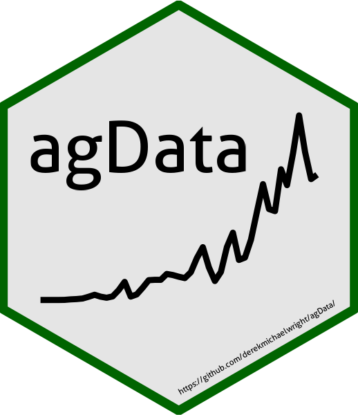
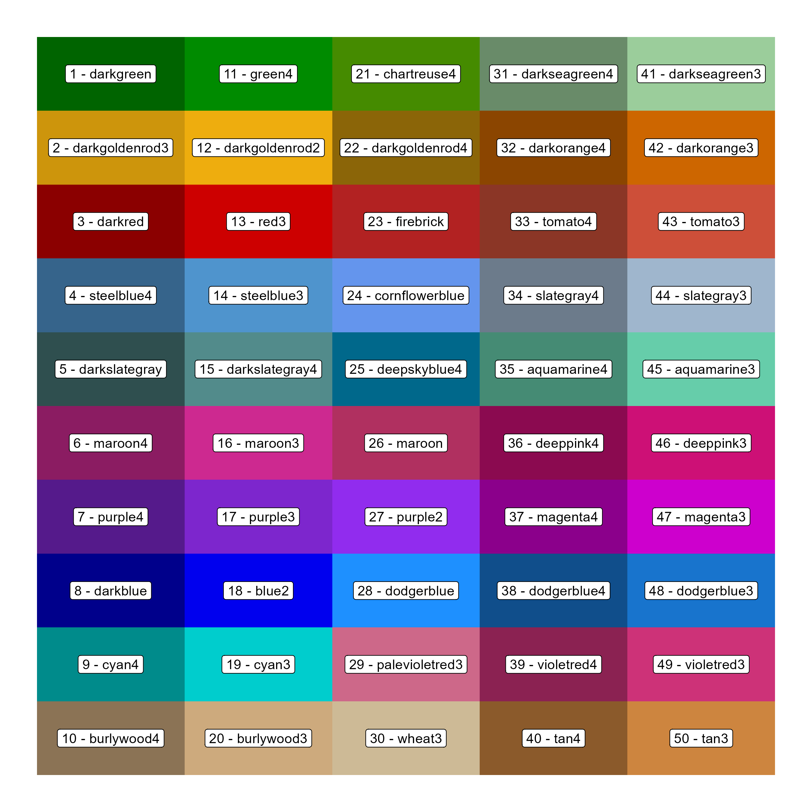

agData R Package
================

`agData`: an `R` package containing various agricultural data sets

# Installation

``` r
devtools::install_github("derekmichaelwright/agData")
```

``` r
library(agData)
```



# Vignettes

<a href="https://dblogr.com/#agdata">
<button class="btn btn-success"><i class="fas fa-chart-line"></i> agData vignettes</button>
</a>

# Data Sources

-   `FAO` Food and Agriculture Organization of the United Nations
    [fao.org/faostat/](www.fao.org/faostat/)
-   `STATCAN` Statistics Canada [statcan.gc.ca/](www.statcan.gc.ca/)
-   `USDA` United States Department of Agriculture
    [usda.gov/](www.usda.gov/)
-   `ISAAA` International Service for the Acquisition of Agri-biotech
    Applications [isaaa.org/](www.isaaa.org/)

------------------------------------------------------------------------

# agData_Colors



``` r
# Prep data
xx <- data.frame(
  Color = factor(agData_Colors, levels = agData_Colors),
  Number = 1:length(agData_Colors),
  Row = rep(1:10, each = 10, length.out = length(agData_Colors)),
  Col = rep(1:10, times = 10, length.out = length(agData_Colors)) )
# Plot
mp <- ggplot(xx, aes(x = Row, y = Col)) +
  geom_tile(aes(fill = Color)) +
  geom_label(aes(label = paste(Number, Color, sep = " - "))) +
  scale_fill_manual(values = agData_Colors) +
  scale_y_reverse() +
  theme_void() +
  theme(legend.position = "none")
ggsave("man/figures/agData_Colors.png", mp, width = 9, height = 9)
```

------------------------------------------------------------------------

# Data sets

## STATCAN

<form action="https://www.dblogr.com/cv" method="get" target="_blank">
<button type="submit">
<i class="fa fa-laptop"></i> HTML
</button>
</form>

<br>

<a href="Data/agData_STATCAN_Crops.csv">
<button class="btn btn-success"><i class="fa fa-save"></i> agData_STATCAN_Crops.csv</button>
</a>

<br>

<a href="Data/agData_STATCAN_Crops2.csv">
<button class="btn btn-success"><i class="fa fa-save"></i> agData_STATCAN_Crops2.csv</button>
</a>

<br>

<a href="Data/agData_STATCAN_Livestock.csv">
<button class="btn btn-success"><i class="fa fa-save"></i> agData_STATCAN_Livestock.csv</button>
</a>

<br>

<a href="Data/agData_STATCAN_Beehives.csv">
<button class="btn btn-success"><i class="fa fa-save"></i> agData_STATCAN_Beehives.csv</button>
</a>

<br>

<a href="Data/agData_STATCAN_FarmLand_Crops.csv">
<button class="btn btn-success"><i class="fa fa-save"></i> agData_STATCAN_FarmLand_Crops.csv</button>
</a>

<br>

<a href="Data/agData_STATCAN_FarmLand_Farms.csv">
<button class="btn btn-success"><i class="fa fa-save"></i> agData_STATCAN_FarmLand_Farms.csv</button>
</a>

<br>

<a href="Data/agData_STATCAN_FarmLand_Inputs.csv">
<button class="btn btn-success"><i class="fa fa-save"></i> agData_STATCAN_FarmLand_Inputs.csv</button>
</a>

<br>

<a href="Data/agData_STATCAN_FarmLand_Size.csv">
<button class="btn btn-success"><i class="fa fa-save"></i> agData_STATCAN_FarmLand_Size.csv</button>
</a>

<br>

<a href="Data/agData_STATCAN_FarmLand_Use.csv">
<button class="btn btn-success"><i class="fa fa-save"></i> agData_STATCAN_FarmLand_Use.csv</button>
</a>

<br>

<a href="Data/agData_STATCAN_Farmers.csv">
<button class="btn btn-success"><i class="fa fa-save"></i> agData_STATCAN_Farmers.csv</button>
</a>

<br>

<a href="Data/agData_STATCAN_Population.csv">
<button class="btn btn-success"><i class="fa fa-save"></i> agData_STATCAN_Population.csv</button>
</a>

<br>

<a href="Data/agData_STATCAN_Region_Table.csv">
<button class="btn btn-success"><i class="fa fa-save"></i> agData_STATCAN_Region_Table.csv</button>
</a>

------------------------------------------------------------------------

## FAO

<br>

<a href="Data/agData_FAO_Crops.csv">
<button class="btn btn-success"><i class="fa fa-save"></i> agData_FAO_Crops.csv</button>
</a>

<br>

<a href="Data/agData_FAO_Crops2.csv">
<button class="btn btn-success"><i class="fa fa-save"></i> agData_FAO_Crops2.csv</button>
</a>

<br>

<a href="Data/agData_FAO_Livestock.csv">
<button class="btn btn-success"><i class="fa fa-save"></i> agData_FAO_Livestock.csv</button>
</a>

<br>

<a href="Data/agData_FAO_Trade_Quantity.csv.gz">
<button class="btn btn-success"><i class="fa fa-save"></i> agData_FAO_Trade_Quantity.csv.gz</button>
</a>

<br>

<a href="Data/agData_FAO_Trade_Value.csv.gz">
<button class="btn btn-success"><i class="fa fa-save"></i> agData_FAO_Trade_Value.csv.gz</button>
</a>

<br>

<a href="Data/agData_FAO_Fertilizers.csv">
<button class="btn btn-success"><i class="fa fa-save"></i> agData_FAO_Fertilizers.csv</button>
</a>

<br>

<a href="Data/agData_FAO_LandUse.csv">
<button class="btn btn-success"><i class="fa fa-save"></i> agData_FAO_LandUse.csv</button>
</a>

<br>

<a href="Data/agData_FAO_Population.csv">
<button class="btn btn-success"><i class="fa fa-save"></i> agData_FAO_Population.csv</button>
</a>

<br>

<a href="Data/agData_FAO_Producer_Prices.csv">
<button class="btn btn-success"><i class="fa fa-save"></i> agData_FAO_Producer_Prices.csv</button>
</a>

<br>

<a href="Data/agData_FAO_Consumer_Prices.csv">
<button class="btn btn-success"><i class="fa fa-save"></i> agData_FAO_Consumer_Prices.csv</button>
</a>

<br>

<a href="Data/agData_FAO_Region_Table.csv">
<button class="btn btn-success"><i class="fa fa-save"></i> agData_FAO_Region_Table.csv</button>
</a>

<br>

<a href="Data/agData_FAO_Country_Table.csv">
<button class="btn btn-success"><i class="fa fa-save"></i> agData_FAO_Country_Table.csv</button>
</a>

------------------------------------------------------------------------

## USDA

<br>

<a href="Data/agData_USDA_Crops.csv">
<button class="btn btn-success"><i class="fa fa-save"></i> agData_USDA_Crops.csv</button>
</a>

<br>

<a href="Data/agData_USDA_GE_Crops.csv">
<button class="btn btn-success"><i class="fa fa-save"></i> agData_USDA_GE_Crops.csv</button>
</a>

<br>

<a href="Data/agData_USDA_TFP.csv">
<button class="btn btn-success"><i class="fa fa-save"></i> agData_USDA_TFP.csv</button>
</a>

------------------------------------------------------------------------

## ISAAA

<br>

<a href="Data/agData_ISAAA_Crop.csv">
<button class="btn btn-success"><i class="fa fa-save"></i> agData_ISAAA_Crop.csv</button>
</a>

<br>

<a href="Data/agData_ISAAA_Area.csv">
<button class="btn btn-success"><i class="fa fa-save"></i> agData_ISAAA_Area.csv</button>
</a>

<br>

<a href="Data/agData_ISAAA_Coutnry.csv">
<button class="btn btn-success"><i class="fa fa-save"></i> agData_ISAAA_Country.csv</button>
</a>

<br>

<a href="Data/agData_ISAAA_CropPercent.csv">
<button class="btn btn-success"><i class="fa fa-save"></i> agData_ISAAA_CropPercent.csv</button>
</a>

<br>

<a href="Data/agData_ISAAA_DVDDVG.csv">
<button class="btn btn-success"><i class="fa fa-save"></i> agData_ISAAA_DVDDVG.csv</button>
</a>

<br>

<a href="Data/agData_ISAAA_Value.csv">
<button class="btn btn-success"><i class="fa fa-save"></i> agData_ISAAA_Value.csv</button>
</a>

------------------------------------------------------------------------

## Other

<br>

<a href="Data/agData_Barulina.csv">
<button class="btn btn-success"><i class="fa fa-save"></i> agData_Barulina.csv</button>
</a>

<br>

<a href="Data/agData_LongTermMaize.csv">
<button class="btn btn-success"><i class="fa fa-save"></i> agData_LongTermMaize.csv</button>
</a>

<br>

<a href="Data/agData_MazieContest.csv">
<button class="btn btn-success"><i class="fa fa-save"></i> agData_MaizeContest.csv</button>
</a>

<br>

<a href="Data/agData_PeopleInAg.csv">
<button class="btn btn-success"><i class="fa fa-save"></i> agData_PeopleInAg.csv</button>
</a>

<br>

<a href="Data/agData_PopFert.csv">
<button class="btn btn-success"><i class="fa fa-save"></i> agData_PopFert.csv</button>
</a>

<br>

<a href="Data/agData_UK_Yields.csv">
<button class="btn btn-success"><i class="fa fa-save"></i> agData_UK_Yields.csv</button>
</a>

------------------------------------------------------------------------

© Derek Michael Wright [www.dblogr.com/](https://dblogr.com/)
