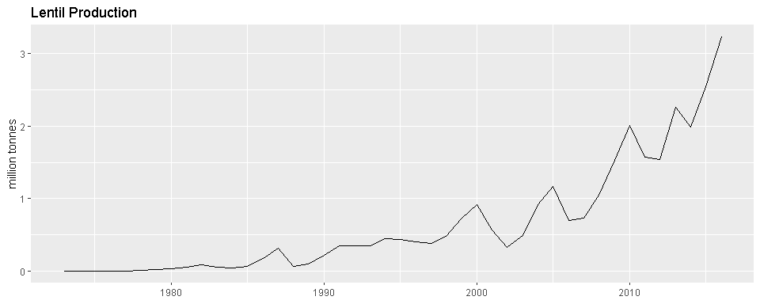

# agData 

`agData` contains various agricultural data sets for quick use in `R`:

  - `agData_FAO_Crops` ( 1961 - 2016 )
  - `agData_FAO_Livestock` ( 1961 - 2016 )
  - `agData_USDA_Crops` ( 1866 - 2017 )
  - `agData_STATCAN_Crops` ( 1908 - 2017 )
  - `agData_STATCAN_Livestock` ( 1921 - 2017 )
  - `agData_STATCAN_Beehives` ( 1924 - 2017 )

## Instalation

Use the following code to install the `agdata` package in R

``` r
devtools::install_github("derekmichaelwright/agData")
```

## Data Sources

  - `STATCAN` Statistics Canada [statcan.gc.ca/](statcan.gc.ca/)  
  - `USDA` United States Department of Agriculture
    [usda.gov/](usda.gov/)
  - `FAO` Food and Agriculture Organization of the United Nations
    [fao.org/faostat/](fao.org/faostat/)

## Explore Data

``` r
# Load libraries
library(agData)
library(tidyverse)
```

``` r
# Load data
xx <- agData_FAO_Crops %>% as.tibble()
xx
```

    ## # A tibble: 2,157,696 x 6
    ##    Area        Crop        Measurement    Unit    Year     Value
    ##    <fct>       <fct>       <fct>          <fct>  <dbl>     <dbl>
    ##  1 Afghanistan Apples      Area harvested ha      1961   2220   
    ##  2 Afghanistan Apples      Yield          hg/ha   1961      6.80
    ##  3 Afghanistan Apples      Production     tonnes  1961  15100   
    ##  4 Afghanistan Apricots    Area harvested ha      1961   4820   
    ##  5 Afghanistan Apricots    Yield          hg/ha   1961      6.64
    ##  6 Afghanistan Apricots    Production     tonnes  1961  32000   
    ##  7 Afghanistan Barley      Area harvested ha      1961 350000   
    ##  8 Afghanistan Barley      Yield          hg/ha   1961      1.08
    ##  9 Afghanistan Barley      Production     tonnes  1961 378000   
    ## 10 Afghanistan Berries nes Area harvested ha      1961   6800   
    ## # ... with 2,157,686 more rows

``` r
# List measurements
xx %>% distinct(Measurement)
```

    ## # A tibble: 3 x 1
    ##   Measurement   
    ##   <fct>         
    ## 1 Area harvested
    ## 2 Yield         
    ## 3 Production

``` r
# List areas
xx %>% distinct(Area)
```

    ## # A tibble: 258 x 1
    ##    Area               
    ##    <fct>              
    ##  1 Afghanistan        
    ##  2 Albania            
    ##  3 Algeria            
    ##  4 American Samoa     
    ##  5 Angola             
    ##  6 Antigua and Barbuda
    ##  7 Argentina          
    ##  8 Australia          
    ##  9 Austria            
    ## 10 Bahamas            
    ## # ... with 248 more rows

``` r
# List crops
xx %>% distinct(Crop)
```

    ## # A tibble: 180 x 1
    ##    Crop             
    ##    <fct>            
    ##  1 Apples           
    ##  2 Apricots         
    ##  3 Barley           
    ##  4 Berries nes      
    ##  5 Cotton lint      
    ##  6 Cottonseed       
    ##  7 Figs             
    ##  8 Fruit, citrus nes
    ##  9 Fruit, fresh nes 
    ## 10 Fruit, stone nes 
    ## # ... with 170 more rows

``` r
# Spread data to wide format
xx %>% 
  unite(Measurement, Measurement, Unit) %>%
  spread(Measurement, Value)
```

    ## # A tibble: 785,117 x 6
    ##    Area    Crop       Year `Area harvested~ Production_tonn~ `Yield_hg/ha`
    ##    <fct>   <fct>     <dbl>            <dbl>            <dbl>         <dbl>
    ##  1 Afghan~ Almonds,~  1975                0                0         NA   
    ##  2 Afghan~ Almonds,~  1976             5900             9800          1.66
    ##  3 Afghan~ Almonds,~  1977             6000             9000          1.5 
    ##  4 Afghan~ Almonds,~  1978             6000            12000          2   
    ##  5 Afghan~ Almonds,~  1979             6000            10500          1.75
    ##  6 Afghan~ Almonds,~  1980             5800             9900          1.71
    ##  7 Afghan~ Almonds,~  1981             5800             8000          1.38
    ##  8 Afghan~ Almonds,~  1982             5800            11000          1.90
    ##  9 Afghan~ Almonds,~  1983             5700             9700          1.70
    ## 10 Afghan~ Almonds,~  1984             5700            10500          1.84
    ## # ... with 785,107 more rows

## A Quick Example

``` r
# Filter data for ploting
xx <- xx %>% 
  filter(Area == "Canada", 
         Crop == "Lentils", 
         Measurement == "Production")
# Plot
ggplot(xx, aes(x = Year, y = Value / 1000000)) + 
  geom_line() +
  labs(title = "Lentil Production", 
       y = "million tonnes",
       x = NULL)
```

<!-- -->
