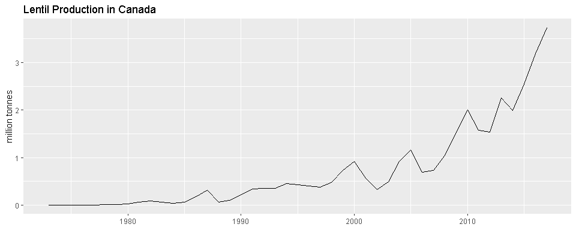
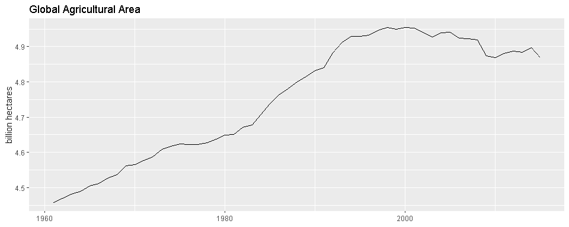
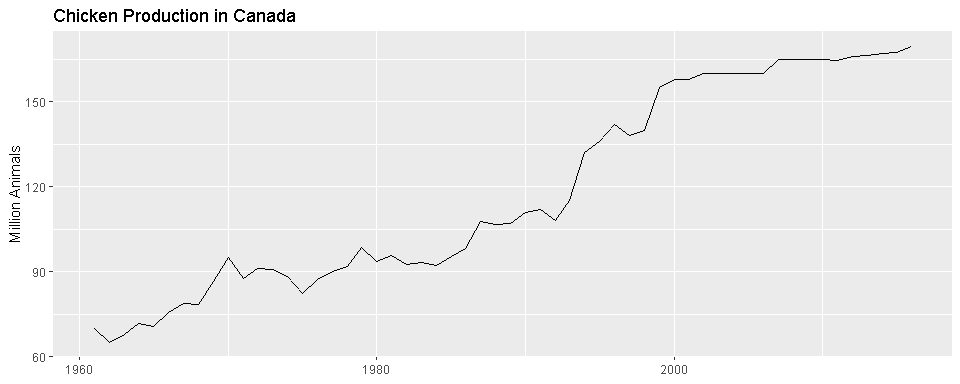
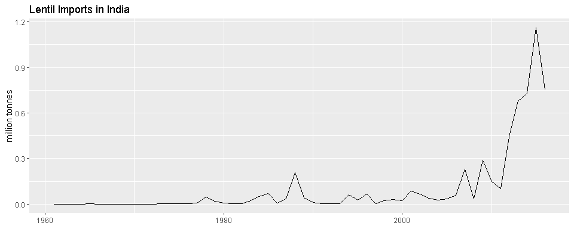
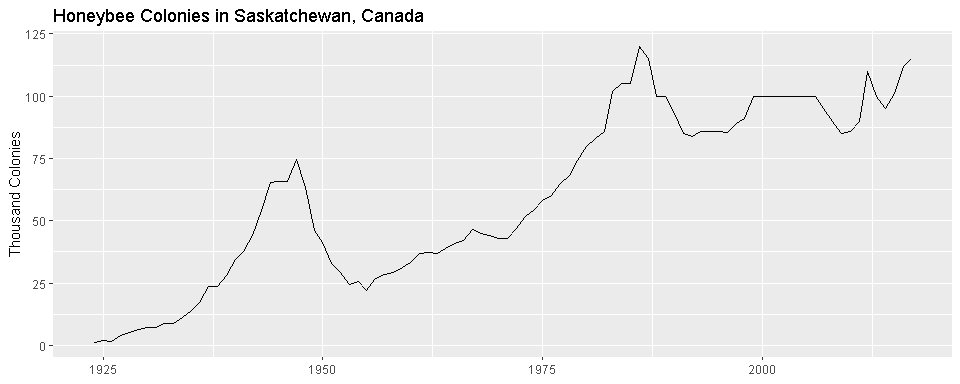
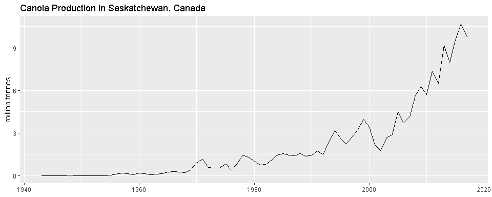
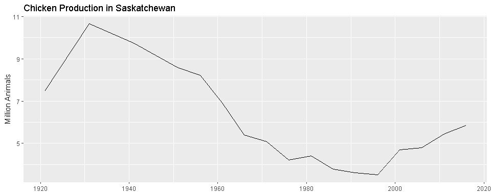
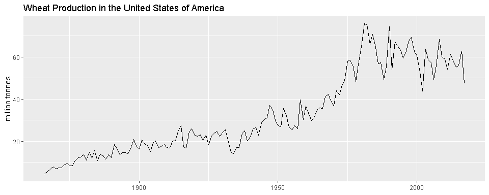

agData R Package
================


`agData` contains various agricultural data sets for quick use in `R`:

  - [`agData_FAO_Crops`](#agdata_fao_crops)
  - [`agData_FAO_LandUse`](#agdata_fao_landuse)
  - [`agData_FAO_Livestock`](#agdata_fao_livestock)
  - [`agData_FAO_Trade`](#agdata_fao_trade)
  - [`agData_STATCAN_Beehives`](#agdata_statcan_beehives)
  - [`agData_STATCAN_Crops`](#agdata_statcan_crops)
  - [`agData_STATCAN_Livestock`](#agdata_statcan_livestock)
  - [`agData_USDA_Crops`](#agdata_usda_crops)

#### Data Sources

  - `STATCAN` Statistics Canada [statcan.gc.ca/](statcan.gc.ca/)
  - `USDA` United States Department of Agriculture
    [usda.gov/](usda.gov/)
  - `FAO` Food and Agriculture Organization of the United Nations
    [fao.org/faostat/](fao.org/faostat/)

## Instalation

Use the following code to install the `agdata` package in R

``` r
devtools::install_github("derekmichaelwright/agData")
```

``` r
library(agData)
```

-----

<em></em>

# agData\_FAO\_Crops

``` r
# Get Data
xx <- agData_FAO_Crops %>% as_tibble()
xx
```

    ## # A tibble: 2,286,683 x 6
    ##    Area        Crop        Measurement    Unit      Year     Value
    ##    <fct>       <fct>       <fct>          <fct>    <dbl>     <dbl>
    ##  1 Afghanistan Apples      Area harvested hectares  1961   2220   
    ##  2 Afghanistan Apples      Yield          t/ha      1961      6.80
    ##  3 Afghanistan Apples      Production     tonnes    1961  15100   
    ##  4 Afghanistan Apricots    Area harvested hectares  1961   4820   
    ##  5 Afghanistan Apricots    Yield          t/ha      1961      6.64
    ##  6 Afghanistan Apricots    Production     tonnes    1961  32000   
    ##  7 Afghanistan Barley      Area harvested hectares  1961 350000   
    ##  8 Afghanistan Barley      Yield          t/ha      1961      1.08
    ##  9 Afghanistan Barley      Production     tonnes    1961 378000   
    ## 10 Afghanistan Berries nes Area harvested hectares  1961   6800   
    ## # ... with 2,286,673 more rows

``` r
# List Measurements
xx %>% distinct(Measurement, Unit)
```

    ## # A tibble: 3 x 2
    ##   Measurement    Unit    
    ##   <fct>          <fct>   
    ## 1 Area harvested hectares
    ## 2 Yield          t/ha    
    ## 3 Production     tonnes

``` r
# List Crops
xx %>% distinct(Crop)
```

    ## # A tibble: 180 x 1
    ##    Crop             
    ##    <fct>            
    ##  1 Apples           
    ##  2 Apricots         
    ##  3 Barley           
    ##  4 Berries nes      
    ##  5 Cotton lint      
    ##  6 Cottonseed       
    ##  7 Figs             
    ##  8 Fruit, citrus nes
    ##  9 Fruit, fresh nes 
    ## 10 Fruit, stone nes 
    ## # ... with 170 more rows

``` r
# Spread data to wide format
xx %>% select(-Unit) %>% spread(Measurement, Value) %>% arrange(Year)
```

    ## # A tibble: 800,096 x 6
    ##    Area       Crop                   Year `Area harvested` Production Yield
    ##    <fct>      <fct>                 <dbl>            <dbl>      <dbl> <dbl>
    ##  1 Afghanist~ Apples                 1961             2220      15100  6.80
    ##  2 Afghanist~ Apricots               1961             4820      32000  6.64
    ##  3 Afghanist~ Barley                 1961           350000     378000  1.08
    ##  4 Afghanist~ Berries nes            1961             6800      60000  8.82
    ##  5 Afghanist~ Cereals (Rice Milled~  1961          3313500    3588773  1.08
    ##  6 Afghanist~ Cereals,Total          1961          3313500    3695000  1.12
    ##  7 Afghanist~ Citrus Fruit,Total     1961             2160      15000  6.94
    ##  8 Afghanist~ Coarse Grain, Total    1961           873500    1097000  1.26
    ##  9 Afghanist~ Cotton lint            1961               NA      17000 NA   
    ## 10 Afghanist~ Cottonseed             1961               NA      34000 NA   
    ## # ... with 800,086 more rows

``` r
# Prep data for an example plot
xx <- xx %>% filter(Area == "Canada", Crop == "Lentils", Measurement == "Production")
# Plot
ggplot(xx, aes(x = Year, y = Value/1000000, group = Area)) + geom_line() +
  labs(title = "Lentil Production in Canada", 
       y = "million tonnes", x = NULL)
```

<!-- -->

-----

<em></em>

# agData\_FAO\_LandUse

``` r
# Get Data
xx <- agData_FAO_LandUse %>% as_tibble()
xx
```

    ## # A tibble: 164,284 x 6
    ##    Area       Type                       Measurement Unit        Year Value
    ##    <fct>      <fct>                      <fct>       <fct>      <dbl> <dbl>
    ##  1 Afghanist~ Country area               Area        1000 hect~  1961 65286
    ##  2 Afghanist~ Land area                  Area        1000 hect~  1961 65286
    ##  3 Afghanist~ Agricultural area          Area        1000 hect~  1961 37700
    ##  4 Afghanist~ Arable land and Permanent~ Area        1000 hect~  1961  7700
    ##  5 Afghanist~ Arable land                Area        1000 hect~  1961  7650
    ##  6 Afghanist~ Permanent crops            Area        1000 hect~  1961    50
    ##  7 Afghanist~ Permanent meadows and pas~ Area        1000 hect~  1961 30000
    ##  8 Afghanist~ Total area equipped for i~ Area        1000 hect~  1961  2380
    ##  9 Albania    Country area               Area        1000 hect~  1961  2875
    ## 10 Albania    Land area                  Area        1000 hect~  1961  2740
    ## # ... with 164,274 more rows

``` r
# List Measurements
xx %>% distinct(Measurement, Unit)
```

    ## # A tibble: 2 x 2
    ##   Measurement                    Unit          
    ##   <fct>                          <fct>         
    ## 1 Area                           1000 hectares 
    ## 2 Carbon stock in living biomass million tonnes

``` r
# List Crops
xx %>% distinct(Type)
```

    ## # A tibble: 41 x 1
    ##    Type                              
    ##    <fct>                             
    ##  1 Country area                      
    ##  2 Land area                         
    ##  3 Agricultural area                 
    ##  4 Arable land and Permanent crops   
    ##  5 Arable land                       
    ##  6 Permanent crops                   
    ##  7 Permanent meadows and pastures    
    ##  8 Total area equipped for irrigation
    ##  9 Inland water                      
    ## 10 Forest                            
    ## # ... with 31 more rows

<em></em>

``` r
# Prep data for an example plot
xx <- xx %>% filter(Area == "World", Type == "Agricultural area")
# Plot
ggplot(xx, aes(x = Year, y = Value/1000000, group = Area)) + geom_line() +
  labs(title = "Global Agricultural Area", 
       y = "billion hectares", x = NULL)
```

<!-- -->

-----

<em></em>

# agData\_FAO\_Livestock

``` r
# Get Data
xx <- agData_FAO_Livestock %>% as_tibble()
xx
```

    ## # A tibble: 164,280 x 6
    ##    Area        Animal               Measurement Unit    Year    Value
    ##    <fct>       <fct>                <fct>       <fct>  <dbl>    <dbl>
    ##  1 Afghanistan Asses                Stocks      number  1961  1300000
    ##  2 Afghanistan Camels               Stocks      number  1961   250000
    ##  3 Afghanistan Cattle               Stocks      number  1961  2900000
    ##  4 Afghanistan Chickens             Stocks      number  1961  4700000
    ##  5 Afghanistan Goats                Stocks      number  1961  4200000
    ##  6 Afghanistan Horses               Stocks      number  1961   276841
    ##  7 Afghanistan Mules                Stocks      number  1961    20000
    ##  8 Afghanistan Sheep                Stocks      number  1961 18000000
    ##  9 Afghanistan Cattle and Buffaloes Stocks      number  1961  2900000
    ## 10 Afghanistan Poultry Birds        Stocks      number  1961  4700000
    ## # ... with 164,270 more rows

``` r
# List Measurements
xx %>% distinct(Measurement, Unit)
```

    ## # A tibble: 1 x 2
    ##   Measurement Unit  
    ##   <fct>       <fct> 
    ## 1 Stocks      number

``` r
# List Crops
xx %>% distinct(Animal)
```

    ## # A tibble: 22 x 1
    ##    Animal              
    ##    <fct>               
    ##  1 Asses               
    ##  2 Camels              
    ##  3 Cattle              
    ##  4 Chickens            
    ##  5 Goats               
    ##  6 Horses              
    ##  7 Mules               
    ##  8 Sheep               
    ##  9 Cattle and Buffaloes
    ## 10 Poultry Birds       
    ## # ... with 12 more rows

<em></em>

``` r
# Prep data for an example plot
xx <- xx %>% filter(Area == "Canada", Animal == "Chickens")
# Plot
ggplot(xx, aes(x = Year, y = Value/1000000, group = Area)) + geom_line() +
  labs(title = "Chicken Production in Canada", 
       y = "Million Animals", x = NULL)
```

<!-- -->

-----

<em></em>

# agData\_FAO\_Trade

``` r
# Get Data
xx <- agData_FAO_Trade %>% as_tibble()
xx
```

    ## # A tibble: 12,574,853 x 6
    ##    Area        Item            Measurement     Unit       Year Value
    ##    <fct>       <fct>           <fct>           <fct>     <dbl> <dbl>
    ##  1 Afghanistan Almonds shelled Export Quantity tonnes     1961     0
    ##  2 Afghanistan Almonds shelled Export Value    1000 $USD  1961     0
    ##  3 Afghanistan Apples          Import Quantity tonnes     1961     0
    ##  4 Afghanistan Apples          Import Value    1000 $USD  1961     0
    ##  5 Afghanistan Apples          Export Quantity tonnes     1961     0
    ##  6 Afghanistan Apples          Export Value    1000 $USD  1961     0
    ##  7 Afghanistan Apricots        Export Quantity tonnes     1961     0
    ##  8 Afghanistan Apricots        Export Value    1000 $USD  1961     0
    ##  9 Afghanistan Apricots, dry   Export Quantity tonnes     1961     0
    ## 10 Afghanistan Apricots, dry   Export Value    1000 $USD  1961     0
    ## # ... with 12,574,843 more rows

``` r
# List Measurements
xx %>% distinct(Measurement, Unit)
```

    ## # A tibble: 4 x 2
    ##   Measurement     Unit     
    ##   <fct>           <fct>    
    ## 1 Export Quantity tonnes   
    ## 2 Export Value    1000 $USD
    ## 3 Import Quantity tonnes   
    ## 4 Import Value    1000 $USD

``` r
# List Crops
xx %>% distinct(Item)
```

    ## # A tibble: 471 x 1
    ##    Item                          
    ##    <fct>                         
    ##  1 Almonds shelled               
    ##  2 Apples                        
    ##  3 Apricots                      
    ##  4 Apricots, dry                 
    ##  5 Bananas                       
    ##  6 Beer of barley                
    ##  7 Beverages, distilled alcoholic
    ##  8 Beverages, non alcoholic      
    ##  9 Bread                         
    ## 10 Butter, cow milk              
    ## # ... with 461 more rows

``` r
# Prep data for an example plot
xx <- xx %>% filter(Area == "India", Item == "Lentils", Measurement == "Import Quantity")
# Plot
ggplot(xx, aes(x = Year, y = Value/1000000, group = Measurement)) + geom_line() +
  labs(title = "Lentil Imports in India", 
       y = "million tonnes", x = NULL)
```

<!-- -->

-----

<em></em>

# agData\_STATCAN\_Beehives

``` r
# Get Data
xx <- agData_STATCAN_Beehives %>% as_tibble()
xx
```

    ## # A tibble: 5,633 x 6
    ##    Area                  Year Animal    Measurement Unit   Value
    ##    <fct>                <int> <chr>     <fct>       <fct>  <dbl>
    ##  1 British Columbia      1924 Honeybees Beekeepers  number  2410
    ##  2 Alberta               1924 Honeybees Beekeepers  number   160
    ##  3 Saskatchewan          1924 Honeybees Beekeepers  number   410
    ##  4 Manitoba              1924 Honeybees Beekeepers  number  1260
    ##  5 Ontario               1924 Honeybees Beekeepers  number 10000
    ##  6 Quebec                1924 Honeybees Beekeepers  number  7400
    ##  7 New Brunswick         1924 Honeybees Beekeepers  number   360
    ##  8 Prince Edward Island  1924 Honeybees Beekeepers  number     5
    ##  9 Nova Scotia           1924 Honeybees Beekeepers  number   200
    ## 10 Canada                1924 Honeybees Beekeepers  number 22205
    ## # ... with 5,623 more rows

``` r
# List Measurements
xx %>% distinct(Measurement, Unit)
```

    ## # A tibble: 6 x 2
    ##   Measurement        Unit        
    ##   <fct>              <fct>       
    ## 1 Beekeepers         number      
    ## 2 Colonies           number      
    ## 3 Production         tonnes      
    ## 4 Value              million $CAD
    ## 5 Yield              kg/colony   
    ## 6 Colonies/Beekeeper number

``` r
# Spread data to wide format
xx %>% select(-Unit) %>% spread(Measurement, Value) %>% arrange(Year)
```

    ## # A tibble: 940 x 9
    ##    Area   Year Animal Beekeepers Colonies `Colonies/Beeke~ Production
    ##    <fct> <int> <chr>       <dbl>    <dbl>            <dbl>      <dbl>
    ##  1 Brit~  1924 Honey~       2410    14600             6.06    307989.
    ##  2 Albe~  1924 Honey~        160       NA            NA        24948.
    ##  3 Sask~  1924 Honey~        410     1200             2.93     35834.
    ##  4 Mani~  1924 Honey~       1260    10840             8.60    295288.
    ##  5 Onta~  1924 Honey~      10000   160000            16      4935081.
    ##  6 Queb~  1924 Honey~       7400    89830            12.1    1974032.
    ##  7 New ~  1924 Honey~        360     2200             6.11     27669.
    ##  8 Prin~  1924 Honey~          5       90            18         1361.
    ##  9 Nova~  1924 Honey~        200     1250             6.25     36287.
    ## 10 Cana~  1924 Honey~      22205   280010            12.6    7638489.
    ## # ... with 930 more rows, and 2 more variables: Value <dbl>, Yield <dbl>

``` r
# Prep data for an example plot
xx <- xx %>% filter(Area == "Saskatchewan", Measurement == "Colonies")
# Plot
ggplot(xx, aes(x = Year, y = Value/1000, group = Area)) + geom_line() +
  labs(title = "Honeybee Colonies in Saskatchewan, Canada", 
       y = "Thousand Colonies", x = NULL)
```

<!-- -->

-----

<em></em>

# agData\_STATCAN\_Crops

``` r
# Get Data
xx <- agData_STATCAN_Crops %>% as_tibble()
xx
```

    ## # A tibble: 65,899 x 6
    ##    Area   Crop                            Measurement  Year Unit      Value
    ##    <fct>  <fct>                           <fct>       <int> <fct>     <dbl>
    ##  1 Canada Barley                          Area seeded  1908 hectares 7.07e5
    ##  2 Canada Beans, all dry (white and colo~ Area seeded  1908 hectares 2.42e4
    ##  3 Canada Buckwheat                       Area seeded  1908 hectares 1.18e5
    ##  4 Canada Corn for grain                  Area seeded  1908 hectares 1.48e5
    ##  5 Canada Corn, fodder                    Area seeded  1908 hectares 1.05e5
    ##  6 Canada Flaxseed                        Area seeded  1908 hectares 5.60e4
    ##  7 Canada Mixed grains                    Area seeded  1908 hectares 2.36e5
    ##  8 Canada Oats                            Area seeded  1908 hectares 3.20e6
    ##  9 Canada Peas, dry                       Area seeded  1908 hectares 1.67e5
    ## 10 Canada Rye, all                        Area seeded  1908 hectares 4.13e4
    ## # ... with 65,889 more rows

``` r
# List Measurements
xx %>% distinct(Measurement, Unit)
```

    ## # A tibble: 5 x 2
    ##   Measurement        Unit    
    ##   <fct>              <fct>   
    ## 1 Area seeded        hectares
    ## 2 Yield              t/ha    
    ## 3 Production         tonnes  
    ## 4 Average farm price $CAD/t  
    ## 5 Area harvested     hectares

``` r
# List Crops
xx %>% distinct(Crop)
```

    ## # A tibble: 44 x 1
    ##    Crop                               
    ##    <fct>                              
    ##  1 Barley                             
    ##  2 Beans, all dry (white and coloured)
    ##  3 Buckwheat                          
    ##  4 Corn for grain                     
    ##  5 Corn, fodder                       
    ##  6 Flaxseed                           
    ##  7 Mixed grains                       
    ##  8 Oats                               
    ##  9 Peas, dry                          
    ## 10 Rye, all                           
    ## # ... with 34 more rows

``` r
# Prep data for an example plot
xx <- xx %>% filter(Area == "Saskatchewan", Crop == "Canola", Measurement == "Production")
# Plot
ggplot(xx, aes(x = Year, y = Value/1000000, group = Area)) + geom_line() +
  labs(title = "Canola Production in Saskatchewan, Canada", 
       y = "million tonnes", x = NULL)
```

<!-- -->

-----

<em></em>

# agData\_STATCAN\_Livestock

``` r
# Get Data
xx <- agData_STATCAN_Livestock %>% as_tibble()
xx
```

    ## # A tibble: 7,625 x 6
    ##    Area   Animal                Measurement              Year Unit    Value
    ##    <fct>  <fct>                 <fct>                   <int> <fct>   <dbl>
    ##  1 Canada Total cattle and cal~ Number of animals        1921 number 8.37e6
    ##  2 Canada Total pigs            Number of farms report~  1921 number 4.53e5
    ##  3 Canada Total pigs            Number of animals        1921 number 3.32e6
    ##  4 Canada Total pigs            Average number of anim~  1921 number 7.00e0
    ##  5 Canada Total sheep and lambs Number of farms report~  1921 number 1.62e5
    ##  6 Canada Total sheep and lambs Number of animals        1921 number 3.20e6
    ##  7 Canada Total sheep and lambs Average number of anim~  1921 number 2.00e1
    ##  8 Canada Horses and ponies     Number of farms report~  1921 number 6.08e5
    ##  9 Canada Horses and ponies     Number of animals        1921 number 3.45e6
    ## 10 Canada Horses and ponies     Average number of anim~  1921 number 6.00e0
    ## # ... with 7,615 more rows

``` r
# List Measurements
xx %>% distinct(Measurement, Unit)
```

    ## # A tibble: 3 x 2
    ##   Measurement               Unit  
    ##   <fct>                     <fct> 
    ## 1 Number of animals         number
    ## 2 Number of farms reporting number
    ## 3 Average number of animals number

``` r
# List Crops
xx %>% distinct(Animal)
```

    ## # A tibble: 26 x 1
    ##    Animal                         
    ##    <fct>                          
    ##  1 Total cattle and calves        
    ##  2 Total pigs                     
    ##  3 Total sheep and lambs          
    ##  4 Horses and ponies              
    ##  5 Total hens and chickens (birds)
    ##  6 Dairy cows                     
    ##  7 Beef cows                      
    ##  8 Total heifers                  
    ##  9 Bulls, 1 year and over         
    ## 10 Steers, 1 year and over        
    ## # ... with 16 more rows

``` r
# Spread data to wide format
xx %>% select(-Unit) %>% spread(Measurement, Value) %>% arrange(Year)
```

    ## # A tibble: 2,625 x 6
    ##    Area   Animal    Year `Average number~ `Number of anim~ `Number of farm~
    ##    <fct>  <fct>    <int>            <dbl>            <dbl>            <dbl>
    ##  1 Briti~ Horses ~  1921                4            61385            14609
    ##  2 Briti~ Total c~  1921               NA           209207               NA
    ##  3 Briti~ Total h~  1921               NA          1967551               NA
    ##  4 Briti~ Total p~  1921                6            41685             6878
    ##  5 Briti~ Total s~  1921               58            61344             1052
    ##  6 Alber~ Horses ~  1921               11           806244            72992
    ##  7 Alber~ Total c~  1921               NA          1383552               NA
    ##  8 Alber~ Total h~  1921               NA          4921870               NA
    ##  9 Alber~ Total p~  1921               10           423258            41029
    ## 10 Alber~ Total s~  1921              105           431464             4110
    ## # ... with 2,615 more rows

``` r
# Prep data for an example plot
xx <- xx %>% filter(Area == "Saskatchewan", Measurement == "Number of animals",
                    Animal == "Total hens and chickens (birds)")
# Plot
ggplot(xx, aes(x = Year, y = Value/1000000)) + geom_line() +
  labs(title = "Chicken Production in Saskatchewan", 
       y = "Million Animals", x = NULL)
```

<!-- -->

-----

<em></em>

# agData\_USDA\_Crops

``` r
# Get Data
xx<- agData_USDA_Crops %>% as_tibble()
xx
```

    ## # A tibble: 2,555 x 6
    ##    Area  Crop   Measurement     Year Unit           Value
    ##    <fct> <fct>  <fct>          <dbl> <fct>          <dbl>
    ##  1 USA   Wheat  Area harvested  1866 hectares  6235402.  
    ##  2 USA   Wheat  Yield           1866 t/ha            0.74
    ##  3 USA   Wheat  Production      1866 tonnes    4618555.  
    ##  4 USA   Maize  Area harvested  1866 hectares 12147460.  
    ##  5 USA   Maize  Yield           1866 t/ha            1.52
    ##  6 USA   Maize  Production      1866 tonnes   18563517.  
    ##  7 USA   Barley Area harvested  1866 hectares   305133.  
    ##  8 USA   Barley Yield           1866 t/ha            1.29
    ##  9 USA   Barley Production      1866 tonnes     393972.  
    ## 10 USA   Oats   Area harvested  1866 hectares  3211183.  
    ## # ... with 2,545 more rows

``` r
# List Measurements
xx %>% distinct(Measurement, Unit)
```

    ## # A tibble: 4 x 2
    ##   Measurement    Unit    
    ##   <fct>          <fct>   
    ## 1 Area harvested hectares
    ## 2 Yield          t/ha    
    ## 3 Production     tonnes  
    ## 4 Area seeded    hectares

``` r
# List Area
xx %>% distinct(Area)
```

    ## # A tibble: 1 x 1
    ##   Area 
    ##   <fct>
    ## 1 USA

``` r
# List Crops
xx %>% distinct(Crop)
```

    ## # A tibble: 5 x 1
    ##   Crop   
    ##   <fct>  
    ## 1 Wheat  
    ## 2 Maize  
    ## 3 Barley 
    ## 4 Oats   
    ## 5 Sorghum

``` r
# Spread data to wide format
xx %>% select(-Unit) %>% spread(Measurement, Value) %>% arrange(Year)
```

    ## # A tibble: 697 x 7
    ##    Area  Crop    Year `Area harvested` `Area seeded` Production Yield
    ##    <fct> <fct>  <dbl>            <dbl>         <dbl>      <dbl> <dbl>
    ##  1 USA   Barley  1866          305133.            NA    393972. 1.29 
    ##  2 USA   Maize   1866        12147460.            NA  18563517. 1.52 
    ##  3 USA   Oats    1866         3211183.            NA   3583486. 1.12 
    ##  4 USA   Wheat   1866         6235402.            NA   4618555. 0.74 
    ##  5 USA   Barley  1867          428158.            NA    519272. 1.21 
    ##  6 USA   Maize   1867        12996896.            NA  20166102. 1.55 
    ##  7 USA   Oats    1867         3308713.            NA   3433043. 1.04 
    ##  8 USA   Wheat   1867         6773634.            NA   5739154. 0.847
    ##  9 USA   Barley  1868          430586.            NA    505120. 1.17 
    ## 10 USA   Maize   1868        14210954.            NA  23358645. 1.64 
    ## # ... with 687 more rows

``` r
# Prep data for an example plot
xx <- xx %>% filter(Crop == "Wheat", Measurement == "Production")
# Plot
ggplot(xx, aes(x = Year, y = Value/1000000, group = Area)) + geom_line() +
  labs(title = "Wheat Production in the United States of America", 
       y = "million tonnes", x = NULL)
```

<!-- -->

-----
