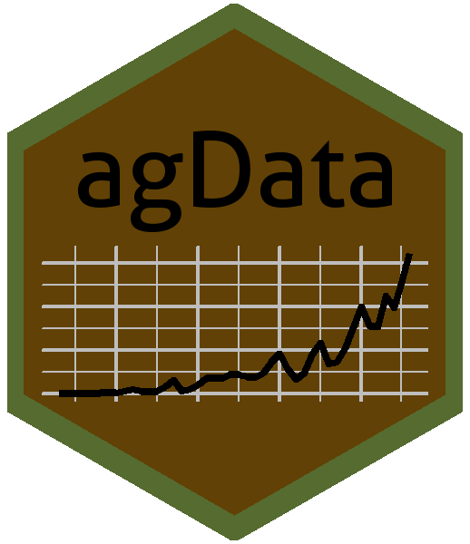

```{r setup, include = FALSE}
knitr::opts_chunk$set(echo = TRUE)
```

```{r warning = F, message = F}
# devtools::install_github("derekmichaelwright/agData")
library(agData)
library(tidyverse)
```

## HexSticker Creation

```{r warning = F}
library(hexSticker)
# Prep data
xx <- agData_FAO_Crops %>% 
  filter(Area    == "Canada", 
         Crop    == "Lentils", 
         Measurement == "Production")
# Create sticker
mp <- ggplot(xx, aes(x = Year, y = Value/1000000)) + 
  geom_line(size = 1) + 
  theme_void() +
  theme(panel.grid.major = element_line(size = 0.5, linetype = 'solid', colour = "grey"), 
        panel.grid.minor = element_line(size = 0.25, linetype = 'solid', colour = "grey")) 
#
sticker(mp,
        package="agData", p_color = "Black", p_size = 30,
        s_x = 1, s_y = 0.8, s_width = 1.5, s_height = 0.6,
        h_fill = "#614105", h_color = "darkolivegreen", h_size = 3)
```

[](#)

---
