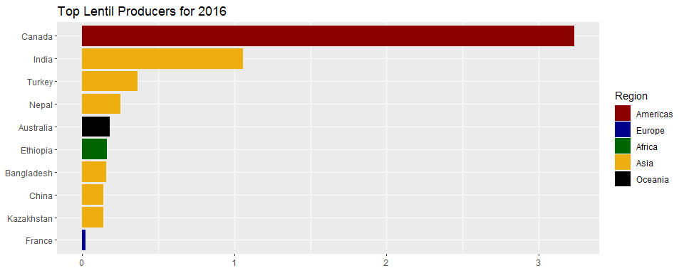
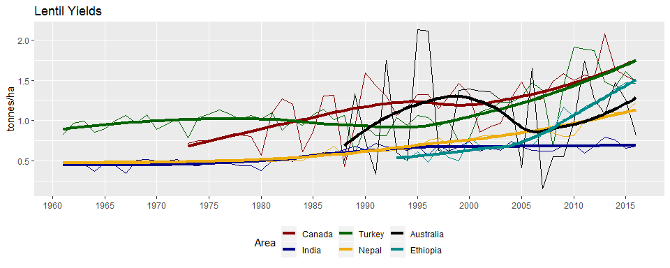
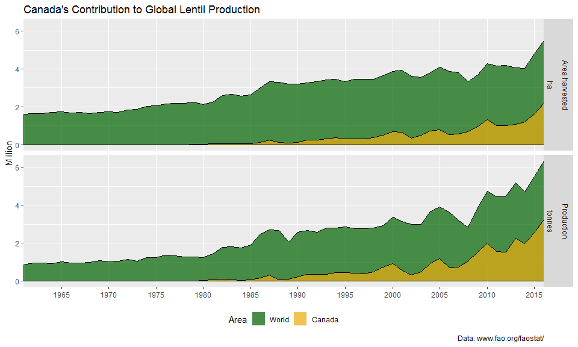

agData Lentil Vignette
================
Derek Michael Wright <derek.wright@usask.ca>
2018-10-26

``` r
# devtools::install_github("derekmichaelwright/agData")
library(agData)
library(tidyverse)
```

Top lentil Producers
--------------------

Since their domesticated in the fertile cresent, lentils spread into Europe and Southern Asia along trade routes, and later, to the americas. Today, most of the production occurs in Southern Asia and North America.

``` r
# Colors for Aesthetics
cols  <- c("darkred", "darkblue", "darkgreen", "darkgoldenrod2", "black", "darkcyan")
# Filter data to find the top producers for 2016
xx <- agData_FAO_Crops %>% 
  addRegionInfo() %>%
  filter(Area %in% agData_FAO_Country_Table$Country,
         Year == 2016, Crop == "Lentils", Measurement == "Production") %>%
  arrange(desc(Value)) %>% 
  slice(1:10) %>%
  mutate(Area = factor(Area, levels = rev(Area)))
```

    ## Warning: Column `Area` joining factor and character vector, coercing into
    ## character vector

``` r
# Plot Data
ggplot(xx, aes(x = Area, y = Value / 1000000, fill = Region)) + 
  geom_bar(stat = "identity") + 
  coord_flip() +
  scale_fill_manual(values = cols) +
  labs(title = "Top Lentil Producers for 2016", 
       x = NULL, y = NULL)
```



``` r
# Select the top 6
xx <- xx %>% slice(1:6)
# Prep data
xx <- agData_FAO_Crops %>%
  filter(Crop == "Lentils",
         Area %in% xx$Area,
         Measurement == "Yield") %>%
  mutate(Area = factor(Area, levels = xx$Area))
# Plot Yields
ggplot(xx, aes(x = Year, y = Value, color = Area)) +
  geom_line() +
  geom_smooth(method = "loess", size = 1.5, se = F) +
  scale_x_continuous(breaks       = seq(1960, 2015, by = 5),
                     minor_breaks = seq(1960, 2015, by = 5)) +
  scale_color_manual(values = cols) +
  theme(legend.position = "bottom") +
  labs(title = "Lentil Yields",
       y = "tonnes/ha", x = NULL)
```



Lentil Production in Canada
---------------------------

Since the introduction of lentil as a crop for the Canadian Prairies (1973), Saskatchewan has become the worlds largest producer of lentils. The first variety, "Laird", was registered in 1979.

``` r
# Prep data
xx <- agData_FAO_Crops %>% 
  filter(Crop    == "Lentils", 
         Measurement != "Yield",
         Area %in% c("Canada", "World") ) %>%
  mutate(Area = factor(Area, levels = c("World", "Canada")))
# Plot
ggplot(xx, aes(x = Year, y = Value / 1000000, fill = Area, color = I("Black"))) +
  geom_area(position = "identity", alpha = 0.7) +
  facet_grid(Measurement+Unit~.) +
  theme(legend.position = "bottom") +
  scale_fill_manual(values = alpha(c("Dark Green", "darkgoldenrod2"), 0.6)) +
  scale_x_continuous(breaks       = seq(1960, 2015, by = 5),
                     minor_breaks = seq(1960, 2015, by = 5),
                     expand = c(0,0))  +
  labs(title   = "Canada's Contribution to Global Lentil Production",
       caption = "Data: www.fao.org/faostat/",
       y = "Million", x = NULL)
```



------------------------------------------------------------------------
