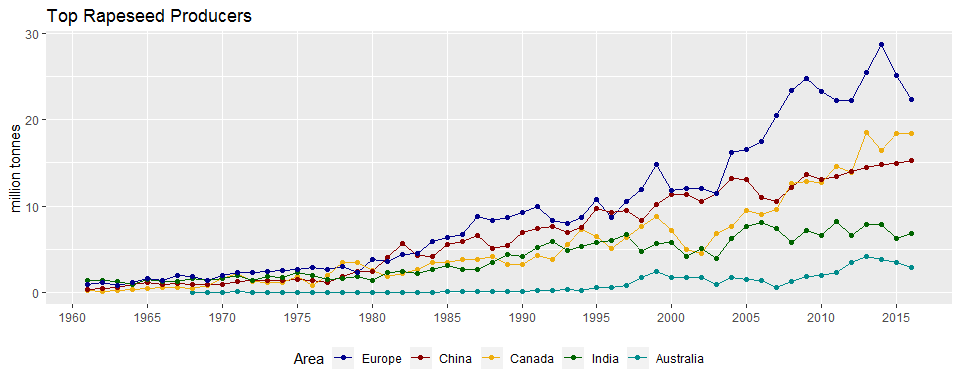
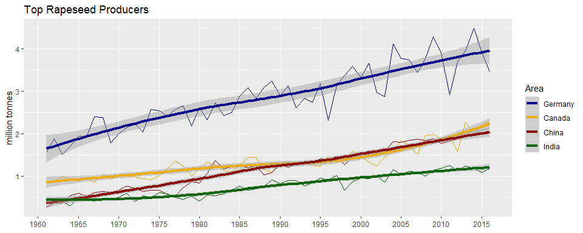

agData Rapeseed Vignette
================
Derek Michael Wright <derek.wright@usask.ca>
2018-10-26

``` r
# devtools::install_github("derekmichaelwright/agData")
library(agData) 
library(tidyverse)
```

Rapeseed production
-------------------

Improvments in oil quality, acheived through plant breeding has resulted in Rapeseed/Canola becoming one of the worlds major oil crops.

``` r
# Prep data
areas <- c("Europe", "China", "Canada", "India", "Australia")
cols  <- c("darkblue", "darkred", "darkgoldenrod2", "darkgreen", "darkcyan")
xx <- agData_FAO_Crops %>% 
  filter(Crop == "Rapeseed",
         Area %in% areas,
         Measurement == "Production") %>%
  mutate(Area = factor(Area, levels = areas))
# Plot
ggplot(xx, aes(x = Year, y = Value / 1000000, color = Area)) +
  geom_line() +
  geom_point() +
  scale_color_manual(values = cols) +
  scale_x_continuous(breaks       = seq(1960, 2015, by = 5),
                     minor_breaks = seq(1960, 2015, by = 5)) +
  theme(legend.position = "bottom") +
  labs(title = "Top Rapeseed Producers", 
       y = "million tonnes", x = NULL)
```



``` r
# Prep data
areas <- c("Germany", "Canada", "China", "India")
cols  <- c("darkblue", "darkgoldenrod2", "darkred", "darkgreen")
xx <- agData_FAO_Crops %>% 
  filter(Crop == "Rapeseed",
         Area %in% areas,
         Measurement == "Yield") %>%
  mutate(Area = factor(Area, levels = areas))
# Plot
ggplot(xx, aes(x = Year, y = Value, color = Area)) +
  geom_line() +
  geom_smooth(method = "loess", size = 1.5) +
  scale_color_manual(values = cols) +
  scale_x_continuous(breaks       = seq(1960, 2015, by = 5),
                     minor_breaks = seq(1960, 2015, by = 5)) +
  labs(title = "Top Rapeseed Producers", 
       y = "million tonnes", x = NULL)
```



------------------------------------------------------------------------
