```{r setup, include = FALSE}
knitr::opts_chunk$set(echo = T, message = F, warning = F)
```

---


# Data Sources

- `FAO` Food and Agriculture Organization of the United Nations [fao.org/faostat/](http://fao.org/faostat/)
- `STATCAN` Statistics Canada [statcan.gc.ca/](http://statcan.gc.ca/)
- `USDA` United States Department of Agriculture [usda.gov/](http://usda.gov/)
- `ISAAA` International Service for the Acquisition of Agri-biotech Applications [isaaa.org/](http://isaaa.org/)

---

# Instalation

```{r eval = F}
devtools::install_github("derekmichaelwright/agData")
```

```{r}
library(agData) # Loads: tidyverse, ggpubr, ggbeeswarm, ggrepel
```

This will also the load the following packages: `tidyverse`, `ggpubr`, `ggbeeswarm`  & `ggrepel`.

---

# Data Sets & Functions

- [theme_agData()](#theme_agdata)
- [agData_FAO_Country_Table](#agdata_fao_country_table)
- [agData_FAO_Region_Table](#agdata_fao_region_table)
- [agData_FAO_Crops](#agdata_fao_crops)
- [agData_FAO_Crops2](#agdata_fao_crops2)
- [agData_FAO_Fertilizers](#agdata_fao_fertilizers)
- [agData_FAO_LandUse](#agdata_fao_landuse)
- [agData_FAO_Livestock](#agdata_fao_livestock)
- [agData_FAO_Population](#agdata_fao_population)
- [agData_FAO_Trade](#agdata_fao_trade)
- [agData_STATCAN_Region_Table](#agdata_statcan_region_table)
- [agData_STATCAN_Beehives](#agdata_statcan_beehives)
- [agData_STATCAN_Crops](#agdata_statcan_crops)
- [agData_STATCAN_FarmLand_Crops](#agdata_statcan_farmland_crops)
- [agData_STATCAN_FarmLand_NoTill](#agdata_statcan_farmland_notill)
- [agData_STATCAN_FarmLand_Size](#agdata_statcan_farmland_size)
- [agData_STATCAN_FarmLand_Use](#agdata_statcan_farmland_use)
- [agData_STATCAN_Livestock](#agdata_statcan_livestock)
- [agData_STATCAN_Population](#agdata_statcan_population)
- [agData_USDA_Crops](#agdata_usda_crops)
- [agData_USDA_GE_Crops](#agdata_usda_ge_crops)
- [agData_USDA_TFP](#agdata_usda_tfp)
- [agData_ISAAA_Area](#agdata_isaaa_area)
- [agData_ISAAA_Country](#agdata_isaaa_country)
- [agData_ISAAA_Crop](#agdata_isaaa_crop)
- [agData_ISAAA_CropPercent](#agdata_isaaa_croppercent)
- [agData_ISAAA_DVDDVG](#agdata_isaaa_dvddvg)
- [agData_ISAAA_Value](#agdata_isaaa_value)
- [agData_UK_Yields](#agdata_uk_yields)
- [agData_MaizeContest](#agdata_maizecontest)
- [agData_PeopleInAg](#agdata_peopleinag)
- [agData_PopFert](#agdata_popfert)

---

# theme_agData

```{r}
xx <- data.frame(x = 1:10, y = 1:10, color = rep(c("1","2"), times = 5, each = 2))
mp <- ggplot(xx, aes(x = x, y = y, color = color)) + 
  geom_point(size = 4) + facet_grid(.~color)
mp
mp + theme_agData()
mp + theme_agData(legend.position = "none")
mp + theme_agData(linesize = 1.5, 
                  bgFill = alpha("darkgreen",0.2), 
                  stripFill = alpha("darkred",0.2),
                  lineColor = "darkorange",
                  axis.text.x = element_text(angle = 90, hjust = 1, vjust = 0.5))
```

---

# agData_FAO_Country_Table

```{r}
DT::datatable(agData_FAO_Country_Table)
```

---

# agData_FAO_Region_Table

```{r}
DT::datatable(agData_FAO_Region_Table)
```

---

# agData_FAO_Crops

```{r}
# Get Data
xx <- agData_FAO_Crops %>% as_tibble()
xx
# List Measurements
xx %>% distinct(Measurement, Unit)
# List Crops
xx %>% distinct(Crop)
# Spread data to wide format
xx %>% select(-Unit) %>% spread(Measurement, Value) %>% arrange(Year)
```

```{r}
# Prep data for an example plot
xx <- xx %>% filter(Area == "World", Crop == "Lentils", Measurement == "Production")
# Plot
mp <- ggplot(xx, aes(x = Year, y = Value / 1000000, group = Area)) + 
  geom_line() + 
  theme_agData() +
  labs(title = "Global Lentil Production", 
       y = "Million Tonnes", x = NULL)
ggsave("Intro_agData_FAO_Crops.png", mp, width = 6, height = 4)
```

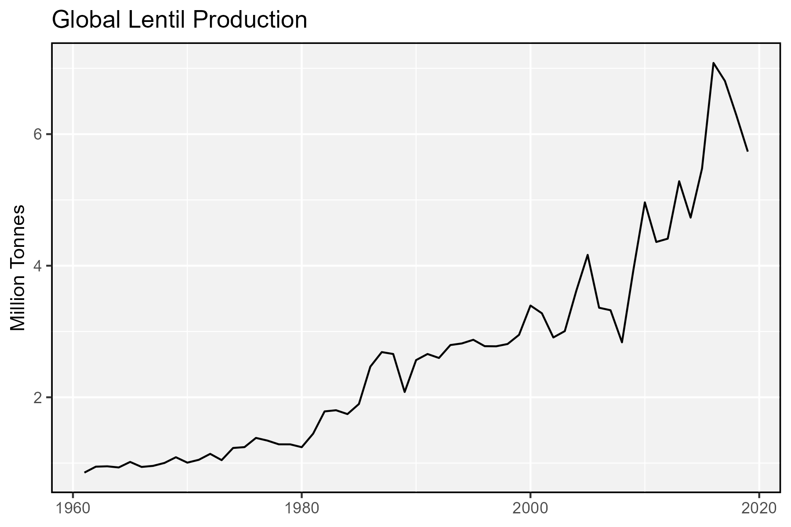

# agData_FAO_Crops2

```{r}
# Get Data
xx <- agData_FAO_Crops2 %>% as_tibble()
xx
# List Measurements
xx %>% distinct(Measurement, Unit)
# List Crops
xx %>% distinct(Crop)
# Spread data to wide format
xx %>% select(-Unit) %>% spread(Measurement, Value) %>% arrange(Year)
```

```{r}
# Prep data for an example plot
xx <- xx %>% filter(Area == "World", Crop == "Cereals", Measurement == "Yield")
# Plot
mp <- ggplot(xx, aes(x = Year, y = Value, group = Area)) + 
  geom_line() + 
  theme_agData() +
  labs(title = "Global Cereal Yields", 
       y = "Tonnes / Hectare", x = NULL)
ggsave("Intro_agData_FAO_Crops2.png", mp, width = 6, height = 4)
```

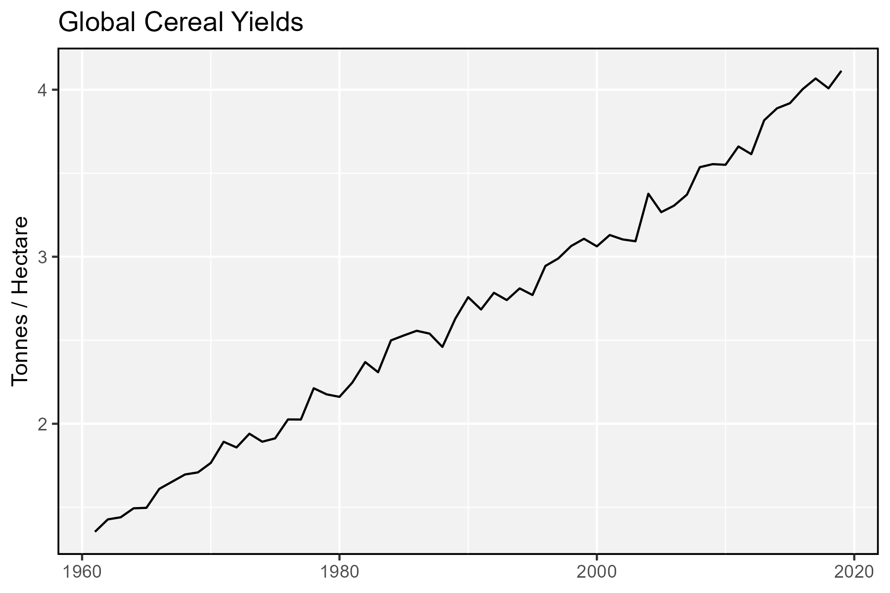

---

# agData_FAO_Fertilizers

```{r}
# Get Data
xx <- agData_FAO_Fertilizers %>% as_tibble()
xx
# List Measurements
xx %>% distinct(Measurement, Unit)
# List Crops
xx %>% distinct(Item)
```

```{r}
# Prep data for an example plot
xx <- xx %>% filter(Area == "China", 
                    Item == "Nitrogenous fertilizers", 
                    Measurement == "Agricultural Use")
# Plot
mp <- ggplot(xx, aes(x = Year, y = Value / 1000000, group = Measurement)) + 
  geom_line() + 
  theme_agData() +
  labs(title = "Nitrogenous fertilizer use in China", 
       y = "Million Tonnes", x = NULL)
ggsave("Intro_agData_FAO_Fertilizers.png", mp, width = 6, height = 4)
```

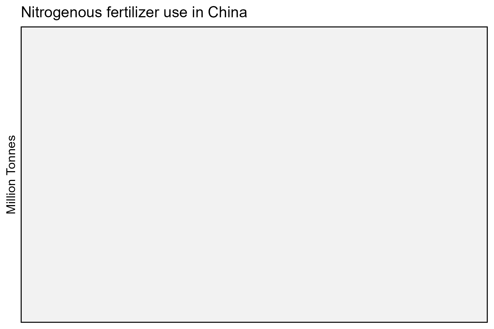

---

# agData_FAO_LandUse

```{r}
# Get Data
xx <- agData_FAO_LandUse %>% as_tibble()
xx
# List Measurements
xx %>% distinct(Measurement, Unit)
# List Crops
xx %>% distinct(Item)
```

```{r}
# Prep data for an example plot
xx <- xx %>% filter(Area == "World", Item == "Agricultural land")
# Plot
mp <- ggplot(xx, aes(x = Year, y = Value / 1000000, group = Area)) + 
  geom_line() + 
  theme_agData() +
  labs(title = "Global Agricultural Area", 
       y = "Billion Hectares", x = NULL)
ggsave("Intro_agData_FAO_LandUse.png", mp, width = 6, height = 4)
```

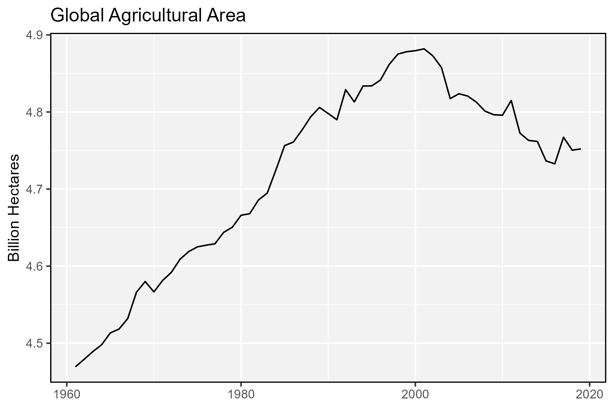

---

# agData_FAO_Livestock
  
```{r}
# Get Data
xx <- agData_FAO_Livestock %>% as_tibble()
xx
# List Measurements
xx %>% distinct(Measurement, Unit)
# List Crops
xx %>% distinct(Animal)
```

```{r}
# Prep data for an example plot
xx <- xx %>% filter(Area == "Canada", Animal == "Chickens")
# Plot
mp <- ggplot(xx, aes(x = Year, y = Value / 1000000, group = Area)) + 
  geom_line() + 
  theme_agData() +
  labs(title = "Chicken Production in Canada", 
       y = "Million Animals", x = NULL)
ggsave("Intro_agData_FAO_Livestock.png", mp, width = 6, height = 4)
```

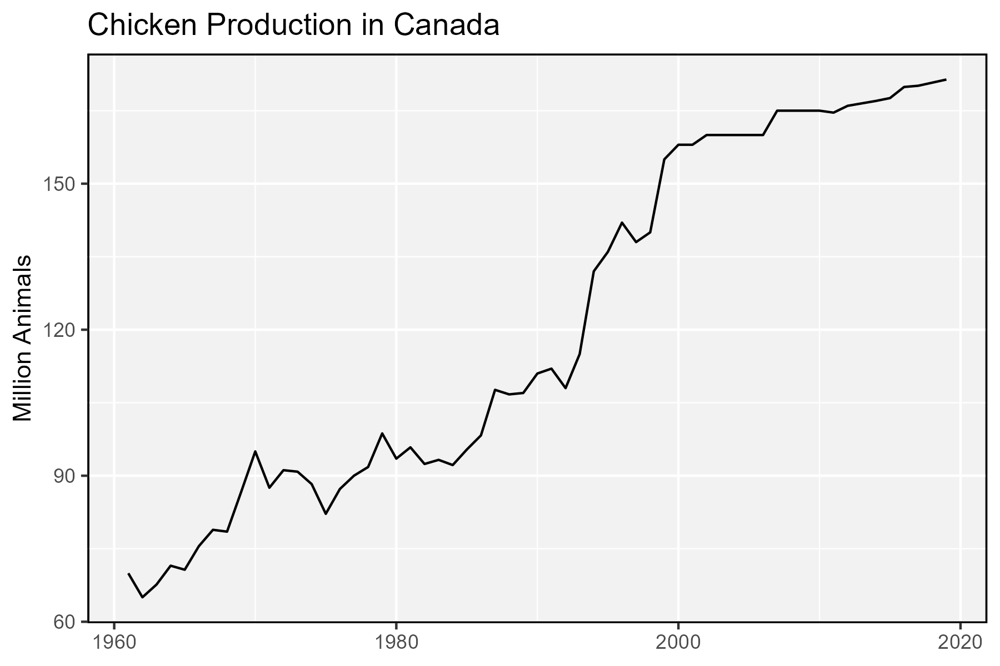

---

# agData_FAO_Population

```{r}
# Get Data
xx <- agData_FAO_Population %>% as_tibble()
# List Measurements
xx %>% distinct(Measurement, Unit)
```

```{r}
# Prep data for an example plot
xx <- xx %>% filter(Area == "World", Measurement == "Total")
# Plot
mp <- ggplot(xx, aes(x = Year, y = Value / 1000000000, group = Measurement)) + 
  geom_line() + 
  theme_agData() +
  labs(title = "World Population", 
       y = "Billion", x = NULL)
ggsave("Intro_agData_FAO_Population.png", mp, width = 6, height = 4)
```

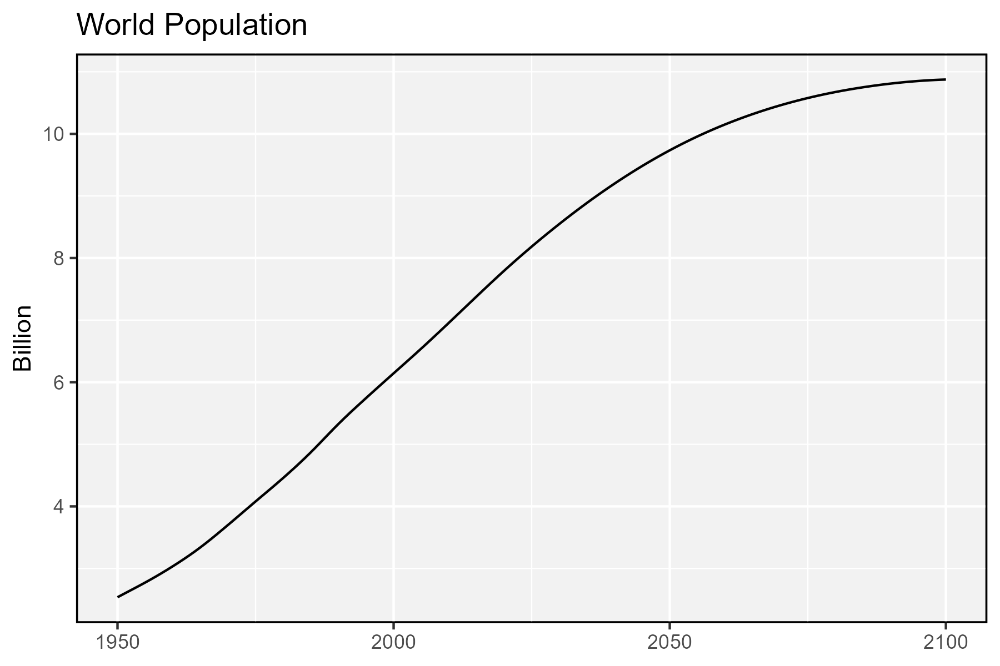

---

# agData_FAO_Trade
  
```{r}
# Get Data
xx <- agData_FAO_Trade %>% as_tibble()
xx
# List Measurements
xx %>% distinct(Measurement, Unit)
# List Crops
xx %>% distinct(Crop)
```

```{r}
# Prep data for an example plot
xx <- xx %>% filter(Area == "India", Crop == "Lentils", Measurement == "Import Quantity")
# Plot
mp <- ggplot(xx, aes(x = Year, y = Value / 1000000, group = Measurement)) + 
  geom_line() + 
  theme_agData() +
  labs(title = "Lentil Imports in India", 
       y = "Million Tonnes", x = NULL)
ggsave("Intro_agData_FAO_Trade.png", mp, width = 6, height = 4)
```


---

# agData_STATCAN_Region_Table

```{r}
DT::datatable(agData_STATCAN_Region_Table)
```

---

# agData_STATCAN_Beehives
  
```{r}
# Get Data
xx <- agData_STATCAN_Beehives %>% as_tibble()
xx
# List Measurements
xx %>% distinct(Measurement, Unit)
# Spread data to wide format
yy <- xx %>% select(-Unit) %>% spread(Measurement, Value) %>% arrange(Year)
str(yy)
```

```{r}
# Prep data for an example plot
xx <- xx %>% filter(Area == "Saskatchewan", Measurement == "Colonies")
# Plot
mp <- ggplot(xx, aes(x = Year, y = Value / 1000, group = Area)) + 
  geom_line() + 
  theme_agData() +
  labs(title = "Honeybee Colonies in Saskatchewan, Canada", 
       y = "Thousand Colonies", x = NULL)
ggsave("Intro_agData_STATCAN_Beehives.png", mp, width = 6, height = 4)
```

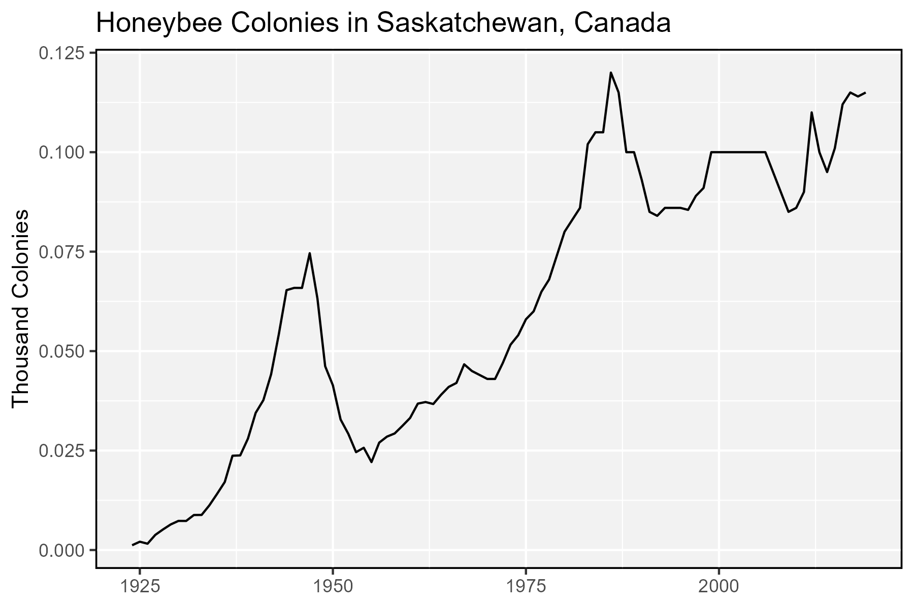

---

# agData_STATCAN_Crops
  
```{r}
# Get Data
xx <- agData_STATCAN_Crops %>% as_tibble()
xx
# List Measurements
xx %>% distinct(Measurement, Unit)
# List Crops
xx %>% distinct(Crop)
```

```{r}
# Prep data for an example plot
xx <- xx %>% filter(Area == "Saskatchewan", Crop == "Canola", Measurement == "Production")
# Plot
mp <- ggplot(xx, aes(x = Year, y = Value / 1000000, group = Area)) + 
  geom_line() + 
  theme_agData() +
  labs(title = "Canola Production in Saskatchewan, Canada", 
       y = "Million Tonnes", x = NULL)
ggsave("Intro_agData_STATCAN_Crops.png", mp, width = 6, height = 4)
```


---

# agData_STATCAN_FarmLand_Crops
  
```{r}
# Get Data
xx <- agData_STATCAN_FarmLand_Crops %>% as_tibble()
xx
# List Measurements
xx %>% distinct(Measurement, Unit)
# List Crops
xx %>% distinct(Crop)
```

```{r}
# Prep data for an example plot
xx <- xx %>% 
  filter(Area == "Saskatchewan", Crop == "Total wheat", 
         Measurement == "Number of farms reporting") %>%
  filter(!is.na(Value))
# Plot
mp <- ggplot(xx, aes(x = Year, y = Value, group = Area)) + 
  geom_line() + 
  theme_agData() +
  labs(title = "Number of Farms Growing Wheat in Saskatchewan, Canada", 
       y = "Million Tonnes", x = NULL)
ggsave("Intro_agData_STATCAN_FarmLand_Crops.png", mp, width = 6, height = 4)
```


---

# agData_STATCAN_FarmLand_NoTill
  
```{r}
# Get Data
xx <- agData_STATCAN_FarmLand_NoTill %>% as_tibble()
xx
# List Measurements
xx %>% distinct(Measurement, Unit)
```

```{r}
# Prep data for an example plot
xx <- xx %>% 
  filter(Area == "Saskatchewan", 
         Unit == "Hectares") %>%
  filter(!is.na(Value))
# Plot
mp <- ggplot(xx, aes(x = Year, y = Value / 1000000, color = Item)) + 
  geom_line() + 
  theme_agData(legend.position = "none") +
  labs(title = "Adoption of No-Till in Saskatchewan", 
       y = "Million Hectares", x = NULL)
ggsave("Intro_agData_STATCAN_FarmLand_Crops.png", mp, width = 6, height = 4)
```


# agData_STATCAN_FarmLand_Size
  
```{r}
# Get Data
xx <- agData_STATCAN_FarmLand_Size %>% as_tibble()
xx
# List Measurements
xx %>% distinct(Measurement)
```

```{r}
# Prep data for an example plot
xx <- xx %>% 
  filter(Area == "Saskatchewan", Year %in% c(1976, 2016),
         Measurement != "Total number of farms")
# Plot
mp <- ggplot(xx, aes(x = Measurement, y = Value, group = Area)) + 
  geom_bar(stat = "identity") + 
  facet_grid(. ~ Year) + 
  theme_agData(axis.text.x = element_text(angle = 90, hjust = 1, vjust = 0.5)) +
  labs(title = "Size of Farms in Saskatchewan", 
       y = "Number of Farms", x = NULL)
ggsave("Intro_agData_STATCAN_FarmLand_Size.png", mp, width = 6, height = 4)
```

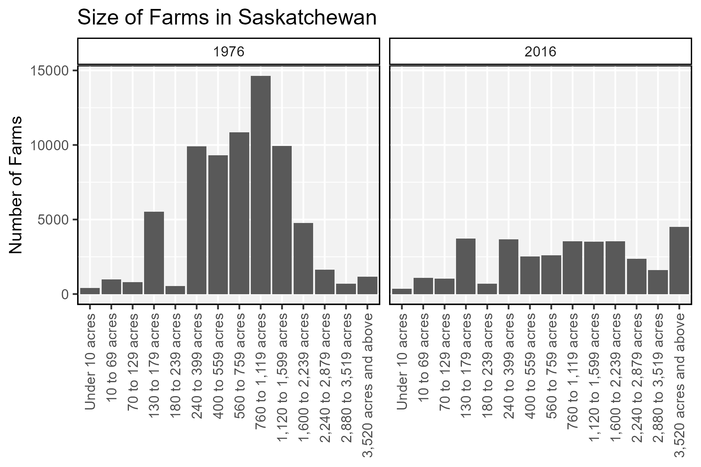

---

# agData_STATCAN_FarmLand_Use
  
```{r}
# Get Data
xx <- agData_STATCAN_FarmLand_Use %>% as_tibble()
xx
# List Measurements
xx %>% distinct(Measurement, Unit)
# List Items
xx %>% distinct(Item)
```

```{r}
# Prep data for an example plot
xx <- xx %>% filter(Area == "Saskatchewan", Item == "Summerfallow land", Unit == "Hectares")
# Plot
mp <- ggplot(xx, aes(x = Year, y = Value / 1000000, group = Area)) + 
  geom_line() + 
  theme_agData() +
  labs(title = "Summerfallow land in Saskatchewan, Canada", 
       y = "Million Hectares", x = NULL)
ggsave("Intro_agData_STATCAN_FarmLand_Use.png", mp, width = 6, height = 4)
```


---

# agData_STATCAN_Livestock
  
```{r}
# Get Data
xx <- agData_STATCAN_Livestock %>% as_tibble()
xx
# List Measurements
xx %>% distinct(Measurement, Unit)
# List Crops
xx %>% distinct(Animal)
```

```{r}
# Prep data for an example plot
xx <- xx %>% filter(Area == "Saskatchewan", 
                    Measurement == "Number of animals",
                    Animal == "Total hens and chickens (birds)")
# Plot
mp <- ggplot(xx, aes(x = Year, y = Value / 1000000)) + 
  geom_line() + 
  theme_agData() +
  labs(title = "Chicken Production in Saskatchewan", 
       y = "Million Animals", x = NULL)
ggsave("Intro_agData_STATCAN_Livestock.png", mp, width = 6, height = 4)
```


---

# agData_STATCAN_Population

```{r}
# Get Data
xx <- agData_STATCAN_Population %>% as_tibble()
xx
```

```{r}
# Prep data for an example plot
xx <- xx %>% filter(Area == "Saskatchewan", Month == 1)
# Plot
mp <- ggplot(xx, aes(x = Year, y = Value / 1000000)) + 
  geom_line() + 
  theme_agData() +
  labs(title = "Population in Saskatchewan, Canada", 
       y = "Million People", x = NULL)
ggsave("Intro_agData_agData_STATCAN_Population.png", mp, width = 6, height = 4)
```

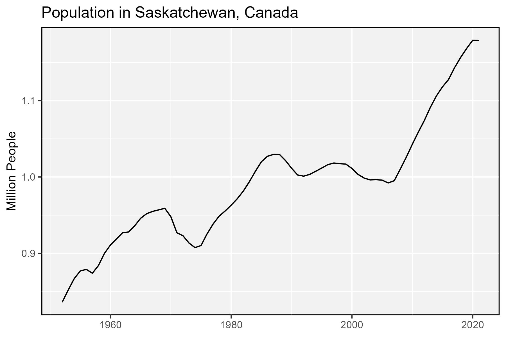

---

# agData_USDA_Crops
  
```{r}
# Get Data
xx <- agData_USDA_Crops %>% as_tibble()
xx
# List Measurements
xx %>% distinct(Measurement, Unit)
# List Area
xx %>% distinct(Area)
# List Crops
xx %>% distinct(Crop)
# Spread data to wide format
xx %>% select(-Unit) %>% spread(Measurement, Value) %>% arrange(Year)
```

```{r}
# Prep data for an example plot
xx <- xx %>% filter(Crop == "Wheat", Measurement == "Production")
# Plot
mp <- ggplot(xx, aes(x = Year, y = Value / 1000000, group = Area)) + 
  geom_line() + 
  theme_agData() +
  labs(title = "Wheat Production in the United States of America", 
       y = "Million Tonnes", x = NULL)
ggsave("Intro_agData_USDA_Crops.png", mp, width = 6, height = 4)
```

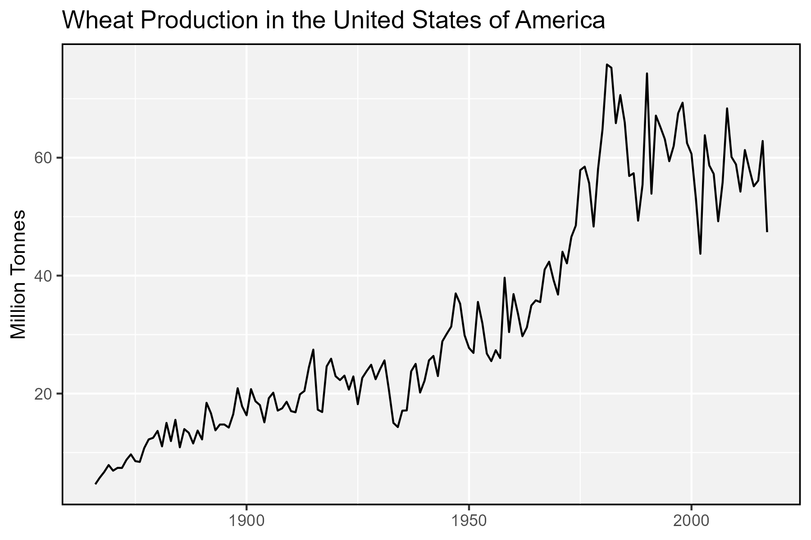

---

# agData_USDA_GE_Crops
  
```{r}
# Get Data
xx <- agData_USDA_GE_Crops %>% as_tibble()
xx
# List Measurements
xx %>% distinct(Measurement, Unit)
# List Area
xx %>% distinct(Area)
# List Crops
xx %>% distinct(Crop)
# Spread data to wide format
xx %>% select(-Unit) %>% spread(Measurement, Value) %>% arrange(Year)
```

```{r}
# Prep data for an example plot
xx <- xx %>% filter(Crop == "Genetically engineered (GE) corn varieties",
                    Area == "U.S.")
# Plot
mp <- ggplot(xx, aes(x = Year, y = Value, color = Measurement)) + 
  geom_line() + 
  theme_agData() +
  labs(title = "Adoption of GE Maize", 
       y = "Percent", x = NULL)
ggsave("Intro_agData_USDA_GE_Crops.png", mp, width = 6, height = 4)
```

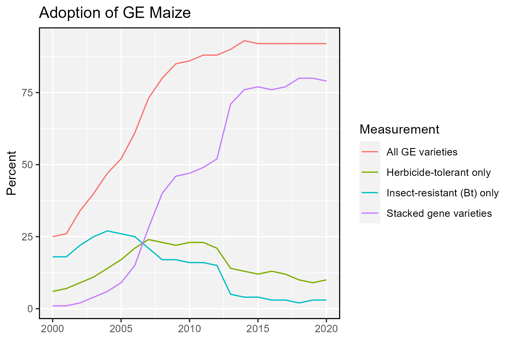

---

# agData_USDA_TFP
  
```{r}
# Get Data
xx <- agData_USDA_TFP %>% as_tibble()
xx
# List Measurements
xx %>% distinct(Measurement)
```

```{r}
# Prep data for an example plot
xx <- xx %>% filter(Area == "World", Measurement == "Ag TFP")
# Plot
mp <- ggplot(xx, aes(x = Year, y = Value / 1000000)) + 
  geom_line() + 
  theme_agData() +
  labs(title = "World Total Factor Productivity", 
       y = "Ag TFP", x = NULL)
ggsave("Intro_agData_USDA_TFP.png", mp, width = 6, height = 4)
```


---

# agData_ISAAA_Area

```{r}
# Get Data
xx <- agData_ISAAA_Area %>% filter(Measurement == "Area") %>% 
  as_tibble()
xx
```

```{r}
# Plot
mp <- ggplot(xx, aes(x = Year, y = Value / 1000000)) + 
  geom_line() + 
  theme_agData() +
  labs(title = "Global Area of Genetically Engineered Crops", 
       y = "Million Hectares", x = NULL)
ggsave("Intro_agData_ISAAA_Area.png", mp, width = 6, height = 4)
```


---

# agData_ISAAA_Country

```{r}
# Get Data
xx <- agData_ISAAA_Country %>% as_tibble()
xx
# List Area
xx %>% distinct(Area)
```

```{r}
# Prep data for an example plot
xx <- xx %>% filter(Area == "Canada", Measurement == "Area")
# Plot
mp <- ggplot(xx, aes(x = Year, y = Value / 1000000)) + 
  geom_line() + 
  theme_agData() +
  labs(title = "Area of Genetically Engineered in Canada", 
       y = "Million Hectares", x = NULL)
ggsave("Intro_agData_ISAAA_Country.png", mp, width = 6, height = 4)
```

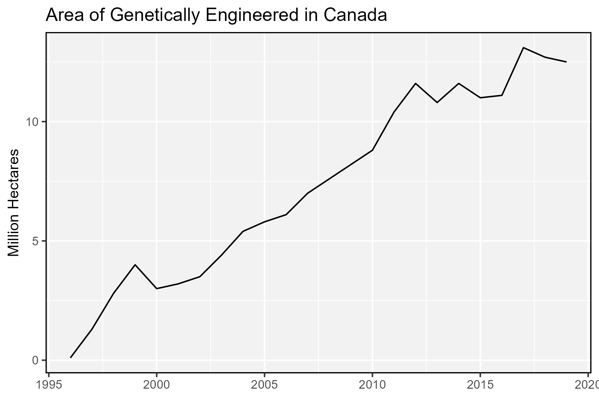

---

# agData_ISAAA_Crop

```{r}
# Get Data
xx <- agData_ISAAA_Crop %>% as_tibble()
xx
# List Crops
xx %>% distinct(Crop)
```

```{r}
# Prep data for an example plot
xx <- xx %>% filter(Crop %in% c("Soybean","Maize"),
                    Measurement == "Area")
# Plot
mp <- ggplot(xx, aes(x = Year, y = Value / 1000000, color = Crop)) + 
  geom_line() + 
  theme_agData() +
  labs(title = "Area of Genetically Engineered Maize and Soybean", 
       y = "Million Hectares", x = NULL)
ggsave("Intro_agData_ISAAA_Crop.png", mp, width = 6, height = 4)
```

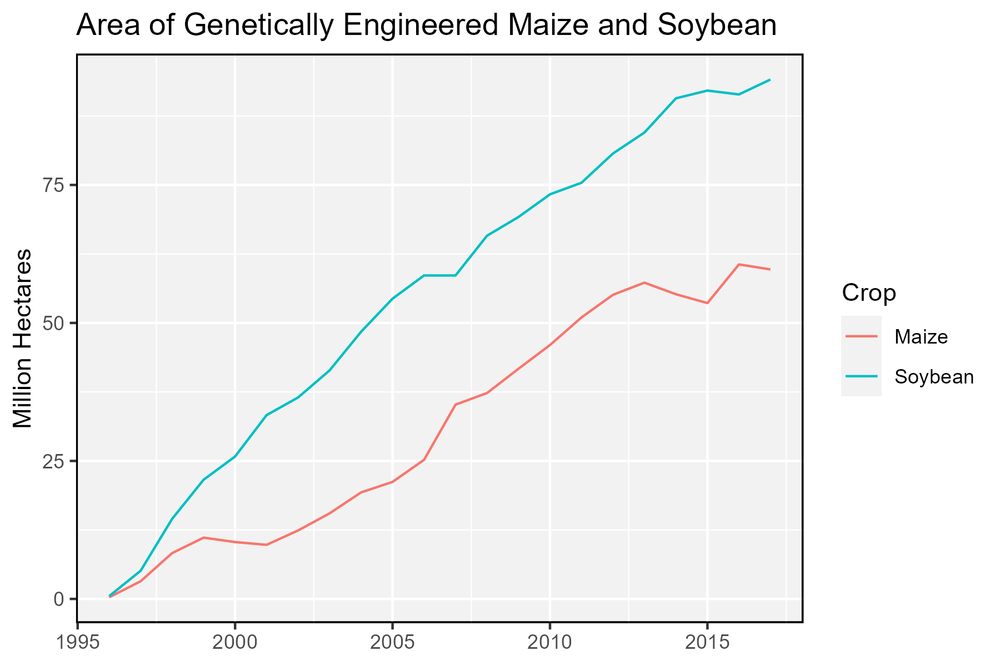

---

# agData_ISAAA_CropPercent

```{r}
# Get Data
xx <- agData_ISAAA_CropPercent %>% as_tibble()
xx
# List Crops
xx %>% distinct(Crop)
```

```{r}
# Prep data for an example plot
xx <- xx %>% filter(Crop %in% c("Soybean","Maize"),
                    Measurement == "Percent")
# Plot
mp <- ggplot(xx, aes(x = Year, y = Value, color = Crop)) + 
  geom_line() + 
  theme_agData() +
  labs(title = "Percent of Global Crop Area Dedicated to GE Varieties", 
       y = "%", x = NULL)
ggsave("Intro_agData_ISAAA_CropPercent.png", mp, width = 6, height = 4)
```

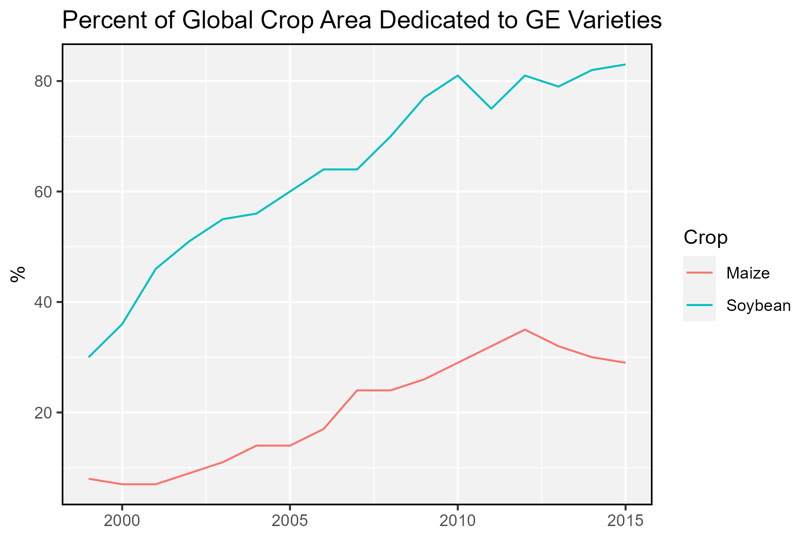

---

# agData_ISAAA_DVDDVG

```{r}
# Get Data
xx <- agData_ISAAA_DVDDVG %>% as_tibble()
xx
```

```{r}
# Prep data
xx <- xx %>% filter(Unit == "Percent")
# Plot
mp <- ggplot(xx, aes(x = Year, y = Value, color = Area)) + 
  geom_line() + 
  theme_agData() +
  labs(title = "Percentage of Genetically Engineered Crops", 
       y = "%", x = NULL)
ggsave("Intro_agData_ISAAA_DVDDVG.png", mp, width = 6, height = 4)
```


---

# agData_ISAAA_Value

```{r}
# Get Data
xx <- agData_ISAAA_Value %>% as_tibble()
xx
```

```{r}
# Plot
mp <- ggplot(xx, aes(x = Year, y = Value)) + 
  geom_line() + 
  theme_agData() +
  labs(title = "Value of Genetically Engineered Seed", 
       y = "Billion USD", x = NULL)
ggsave("Intro_agData_ISAAA_Value.png", mp, width = 6, height = 4)
```

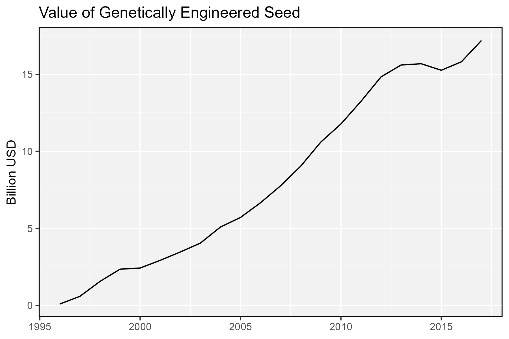

---

# agData_UK_Yields

```{r}
# Get Data
xx <- agData_UK_Yields %>% as_tibble()
xx
# List Measurements
xx %>% distinct(Measurement, Unit)
# List Crops
xx %>% distinct(Crop)
```

```{r}
# Prep data
xx <- xx %>% filter(Crop == "Wheat", !is.na(Value))
# Plot
mp <- ggplot(xx, aes(x = Year, y = Value)) + 
  geom_line() + 
  theme_agData() +
  labs(title = "UK Wheat Yields", y = "Tonnes / Hectare", x = NULL)
ggsave("Intro_agData_UK_Yields.png", mp, width = 6, height = 4)
```


---

# agData_MaizeContest

```{r}
# Get Data
xx <- agData_MaizeContest %>% as_tibble()
xx
```

```{r}
# Prep Data
xx <- xx %>% filter(Unit == "Tonnes/Hectare")
# Plot
mp <- ggplot(xx, aes(x = Year, y = Value, color = Measurement)) + 
  geom_line() + 
  theme_agData() +
  labs(title = "USA Maize Yield Contests", 
       y = "Tonnes / Hectare", x = NULL)
ggsave("Intro_agData_MaizeContest.png", mp, width = 6, height = 4)
```


---

# agData_PeopleInAg

```{r}
# Get Data
xx <- agData_PeopleInAg %>% as_tibble()
xx
```

```{r}
# Prep Data
xx <- xx %>% filter(Area == "Germany")
# Plot
mp <- ggplot(xx, aes(x = Year, y = Value)) + 
  geom_line() + 
  theme_agData() +
  labs(title = "Percent of Population in Agriculture", 
       y = NULL, x = NULL)
ggsave("Intro_agData_People.png", mp, width = 6, height = 4)
```

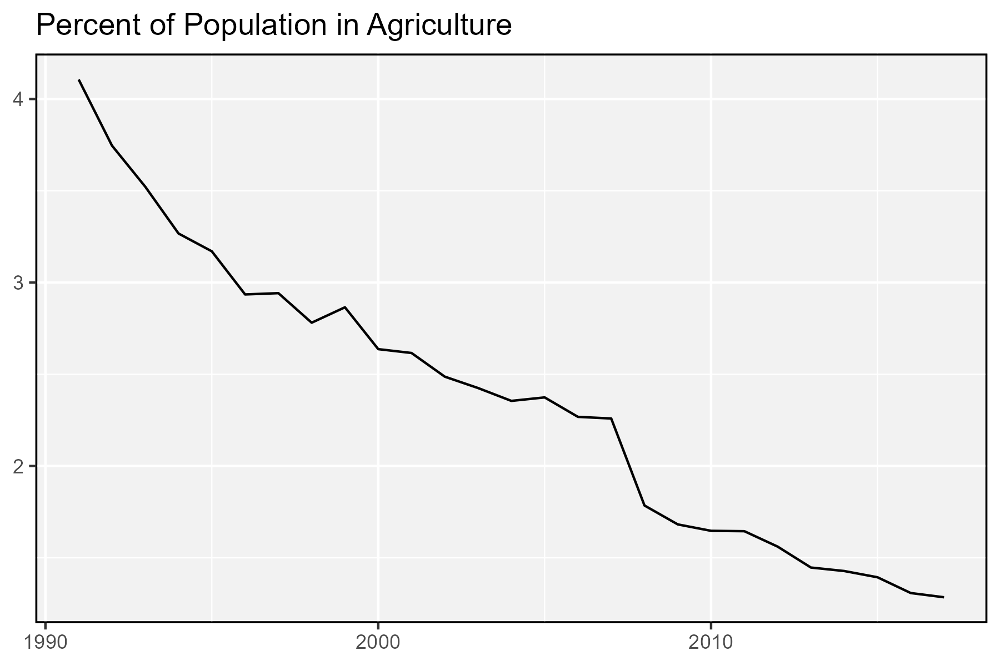

---

# agData_PopFert

```{r}
# Get Data
xx <- agData_PopFert %>% as_tibble()
xx
# List Measurements
xx %>% distinct(Measurement)
```

```{r}
# Plot
mp <- ggplot(xx, aes(x = Year, y = Value, color = Measurement)) + 
  geom_line() + 
  theme_agData() +
  labs(y = NULL, x = NULL)
ggsave("Intro_agData_PopFert.png", mp, width = 6, height = 4)
```

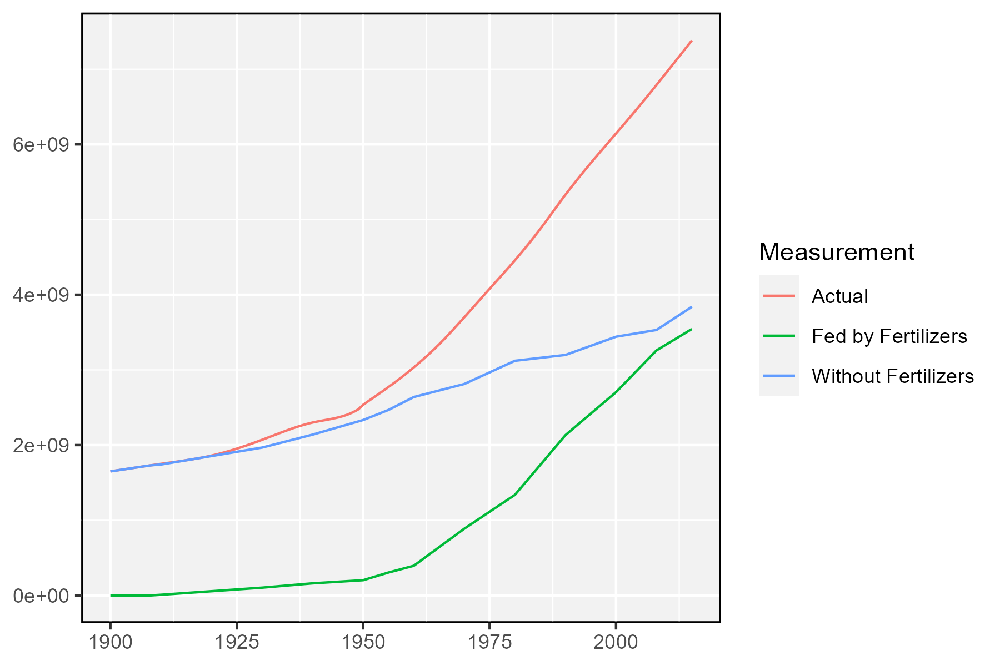

---

&copy; Derek Michael Wright [www.dblogr.com/](https://dblogr.com/)